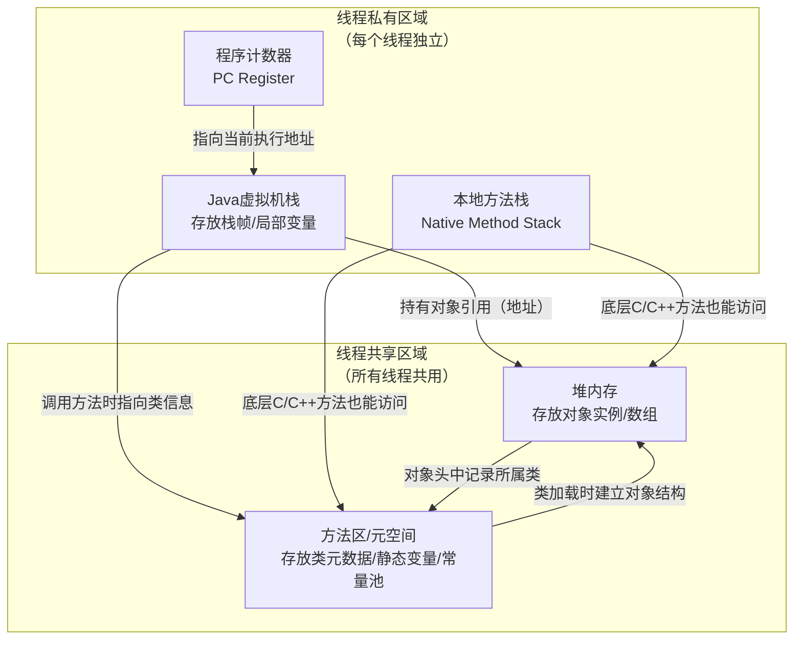

[toc]


# Day01-Java 入门

## Java 学习介绍

1. OOP
2. Java 核心知识点
   1. API
   2. 集合
   3. BIO
   4. NIO
   5. 多线程
   6. 网络编程
3. 斯坦福大学真题练习
4. 阿里巴巴的编码规范
5. 手写 Tomcat 服务器，虚拟机，算法，数据结构
6. 老师多年经验心得

## 人机交互

### 人机交互小故事

只有命令行

MS-DOS

XEROX--> 图形化界面

但是图形化界面

- 消耗内存
- 运行速度慢

### 打开 CMD

`win+r`

`cmd`

### 常用 CMD 命令

#### 盘符名称+冒号


# day09-面向对象综合训练

## 文字版格斗游戏


### 自行作答

```java
package com.itheima.test1;

public class Role {
    private String name;
    private int blood;

    public Role() {
    }

    public Role(String name, int blood) {
        this.name = name;
        this.blood = blood;
    }

    public String getName() {
        return name;
    }

    public void setName(String name) {
        this.name = name;
    }

    public int getBlood() {
        return blood;
    }

    public void setBlood(int blood) {
        this.blood = blood;
    }

    public void attack(Role attacker, Role target, int damage) {
        target.setBlood(target.getBlood()-damage);
        if(target.getBlood()<=0){
            System.out.println(attacker.getName()+"KO了"+target.getName());
        }else{
            System.out.println(attacker.getName() + "攻击了" + target.getName()+"造成了"+damage+"点伤害，"+target.getName()+"还剩下"+target.getBlood()+"点血");
        }
    }
}
```

### 参考答案

对象调用方法，在该方法内需要使用该对象调用别的方法，可以直接使用 this 关键字，**不用再将对象作为参数传入**

> - 具体体现为方法 `public void attack(Role1 target)` 仅有一个参数
> - 另外注意，血量不能低于 100，`remainBlood = remainBlood < 0 ?0 : remainBlood;`

```java
//参考答案：attack()方法改进
package com.itheima.test1;

import java.util.Random;

public class Role1 {
    private String name;
    private int blood;

    public Role1() {
    }

    public Role1(String name, int blood) {
        this.name = name;
        this.blood = blood;
    }

    public String getName() {
        return name;
    }

    public void setName(String name) {
        this.name = name;
    }

    public int getBlood() {
        return blood;
    }

    public void setBlood(int blood) {
        this.blood = blood;
    }

    public void attack(Role1 target){
        //计算造成的伤害
        Random random = new Random();
        int damage = random.nextInt(20)+1;

        //剩余血量
        int remainBlood = target.getBlood()-damage;
        remainBlood = remainBlood < 0 ?0 : remainBlood;
        target.setBlood(remainBlood);

        //使用this关键字
        System.out.println(this.getName() + "攻击了" + target.getName()+"造成了"+damage+"点伤害，"+target.getName()+"还剩下"+target.getBlood()+"点血");
    }
}
```

```Java
package com.itheima.test1;

public class RoleTest1 {
    static void main(String[] args) {
        Role1 r1 = new Role1("乔峰", 100);
        Role1 r2 = new Role1("鸠摩智", 100);

        while(true){
            r1.attack(r2);
            if(r2.getBlood()<=0){
                System.out.println(r1.getName()+"KO了"+r2.getName());
                break;
            }
            r2.attack(r1);
            if(r1.getBlood()<=0){
                System.out.println(r2.getName()+"KO了"+r1.getName());
                break;
            }
        }

    }
}
```

### 题目改进


在此之间，先来讲讲另一种输出语句：`souf`

```java
System.out.printf("");
使用方法和C中的差不多
没有换行效果
```


| 格式符  | 类型           | 示例           |
| ------- | -------------- | -------------- |
| %d      | 十进制整数     | int            |
| %f      | 浮点数         | float / double |
| %s      | 字符串         | String         |
| %c      | 字符           | char           |
| %b      | 布尔值         | boolean        |
| %x / %X | 十六进制整数   | int            |
| %o      | 八进制整数     | int            |
| %e / %E | 科学计数法     | double         |
| %n      | 平台独立换行符 | 无参数         |

------

```java
package com.itheima.test1_1;

import java.util.Random;

public class Role {
    private String name;
    private int blood;
    private char gender;
    private String face;//题目要求，长相随机

    //容颜：

    String[] boyfaces= {"风流俊雅","气宇轩昂","相貌英俊","五官端正","相貌平平","一塌糊涂","面目狰狞"};
    String[] girlfaces ={"美奂绝伦","沉鱼落雁","婷婷玉立","身材娇好","相貌平平","相貌简陋","惨不忍睹"};

    public Role() {
    }

    public Role(String name, int blood, char gender) {
        this.name = name;
        this.blood = blood;
        this.gender = gender;
        this.setFace();
    }

    public String getName() {
        return name;
    }

    public void setName(String name) {
        this.name = name;
    }

    public int getBlood() {
        return blood;
    }

    public void setBlood(int blood) {
        this.blood = blood;
    }

    public char getGender() {
        return gender;
    }

    public void setGender(char gender) {
        this.gender = gender;
    }

    public String getFace() {
        return face;
    }

    public void setFace() {
        Random random = new Random();
        int index = random.nextInt(girlfaces.length);
        if(gender == '女'){
            this.face = girlfaces[index];
        }else if(gender == '男'){
            this.face = boyfaces[index];
        }else{
            this.face = "默认面孔";
        }

    }

    //attack 攻击描述：
    String[] attacks_desc={
            "%s使出了一招【背心钉】，转到对方的身后，一掌向%s背心的灵台穴拍去。",
            "%s使出了一招【游空探爪】，飞起身形自半空中变掌为抓锁向%s。",
            "%s大喝一声，身形下伏，一招【劈雷坠地】，捶向%s双腿。",
            "%s运气于掌，一瞬间掌心变得血红，一式【掌心雷】，推向%s。",
            "%s阴手翻起阳手跟进，一招【没遮拦】，结结实实的捶向%s。",
            "%s上步抢身，招中套招，一招【劈挂连环】，连环攻向%s。"
    };

    //injured 受伤描述：
    String[] injureds_desc={
            "结果%s退了半步，毫发无损",
            "结果给%s造成一处瘀伤",
            "结果一击命中，%s痛得弯下腰",
            "结果%s痛苦地闷哼了一声，显然受了点内伤",
            "结果%s摇摇晃晃，一跤摔倒在地",
            "结果%s脸色一下变得惨白，连退了好几步",
            "结果『轰』的一声，%s口中鲜血狂喷而出",
            "结果%s一声惨叫，像滩软泥般塌了下去"
    };

    public void attack(Role target) {
        Random random = new Random();
        //随机获得攻击
        int indexAttack = random.nextInt(attacks_desc.length);
        System.out.printf(attacks_desc[indexAttack], this.name, target.name);

        //随机获得攻击值
        int damage = random.nextInt(20) + 1;
        target.setBlood((target.getBlood() - damage) < 0 ? 0 : target.getBlood() - damage);

        //受伤描述和血量对应
        int indexIngured = 0;
        int targetBlood = target.getBlood();
        if (targetBlood > 90) {
            indexIngured = 0;
        } else if (targetBlood > 80) {
            indexIngured = 1;
        } else if (targetBlood > 70) {
            indexIngured = 2;
        } else if (targetBlood > 60) {
            indexIngured = 3;
        } else if (targetBlood > 40) {
            indexIngured = 4;
        } else if (targetBlood > 20) {
            indexIngured = 5;
        } else if (targetBlood > 10) {
            indexIngured = 6;
        } else {
            indexIngured = 7;
        }
        System.out.printf(injureds_desc[indexIngured], target.name);
        System.out.println();
    }

    public void showInfo() {
        System.out.printf("姓名：%s，血量：%d，性别：%s， appearance：%s\n",getName(),getBlood(),getGender(),getFace());
    }

}
```

```java
package com.itheima.test1_1;

public class RoleTest {
    static void main(String[] args) {
        Role role1 = new Role("乔峰", 100, '男');
        Role role2 = new Role("鸠摩智", 100, '男');

        role1.showInfo();
        role2.showInfo();

        while(true){
            role1.attack(role2);
            if(role2.getBlood()<=0){
                System.out.println(role1.getName()+"KO了"+role2.getName());
                break;
            }
            role2.attack(role1);
            if(role1.getBlood()<=0){
                System.out.println(role2.getName()+"KO了"+role1.getName());
                break;
            }
        }
    }
}
```

## 两个对象的数组


### 自行作答

ptg 插件真好用 👍

```java
package com.itheima.test2;

public class Goods {
    private String id;
    private String name;
    private double price;
    private int store;

    public Goods() {
    }

    public Goods(String id, String name, double price, int store) {
        this.id = id;
        this.name = name;
        this.price = price;
        this.store = store;
    }

    /**
     * 获取
     *
     * @return id
     */
    public String getId() {
        return id;
    }

    /**
     * 设置
     *
     * @param id
     */
    public void setId(String id) {
        this.id = id;
    }

    /**
     * 获取
     *
     * @return name
     */
    public String getName() {
        return name;
    }

    /**
     * 设置
     *
     * @param name
     */
    public void setName(String name) {
        this.name = name;
    }

    /**
     * 获取
     *
     * @return price
     */
    public double getPrice() {
        return price;
    }

    /**
     * 设置
     *
     * @param price
     */
    public void setPrice(double price) {
        this.price = price;
    }

    /**
     * 获取
     *
     * @return store
     */
    public int getStore() {
        return store;
    }

    /**
     * 设置
     *
     * @param store
     */
    public void setStore(int store) {
        this.store = store;
    }


}
```

```java
package com.itheima.test2;

public class GoodsTest {
    static void main(String[] args) {
        Goods[] goods = new Goods[3];

        goods[0] = new Goods("001", "电脑", 5000, 10);
        goods[1] = new Goods("002", "鼠标", 10, 20);
        goods[2] = new Goods("003", "游艇", 500, 5);


        for (int i = 0; i < goods.length; i++){
            System.out.println(goods[i].getId() + " " + goods[i].getName() + " " + goods[i].getPrice() + " " + goods[i].getStore());
        }
    }
}
```


### 题目改进 1


```java
package com.itheima.test2_2;

public class Car {
    private String brand ;
    private double price;
    private String color;


    public Car() {
    }

    public Car(String brand, double price, String color) {
        this.brand = brand;
        this.price = price;
        this.color = color;
    }

    /**
     * 获取
     * @return brand
     */
    public String getBrand() {
        return brand;
    }

    /**
     * 设置
     * @param brand
     */
    public void setBrand(String brand) {
        this.brand = brand;
    }

    /**
     * 获取
     * @return price
     */
    public double getPrice() {
        return price;
    }

    /**
     * 设置
     * @param price
     */
    public void setPrice(double price) {
        this.price = price;
    }

    /**
     * 获取
     * @return color
     */
    public String getColor() {
        return color;
    }

    /**
     * 设置
     * @param color
     */
    public void setColor(String color) {
        this.color = color;
    }


}
```


```java
package com.itheima.test2_2;

import java.util.Scanner;
/*
丰田
200000
白色
本田
150000
黑色
特斯拉
350000
红色
 */

public class CarTest {
    static void main(String[] args) {
        Car[] cars = new Car[3];

        Scanner scanner = new Scanner(System.in);

        for(int i = 0; i < cars.length; i++) {
            System.out.println("请输入第" + (i + 1) + "辆车的牌：");
            String brand = scanner.next();
            System.out.println("请输入第" + (i + 1) + "辆车的价格：");
            double price = scanner.nextDouble();
            System.out.println("请输入第" + (i + 1) + "辆车的颜色：");
            String color = scanner.next();
            cars[i] = new Car(brand, price, color);
        }

        for(int i = 0; i < cars.length; i++) {
            System.out.println(cars[i].getBrand() + " " + cars[i].getPrice() + " " + cars[i].getColor());
        }
    }
}
```


#### 补充：关于输入方法 ✍

大致分为两种：对于换行符 `\n` 的处理

1. 读取之后不消费换行符的：`next()`、`nextInt()`、`nextDouble()`、`nextBoolean()`、`nextLong()`、`nextFloat()`、`nextByte()`、`nextShort()`）
2. 读取后消费换行符的：`nextLine()`

------

不建议两种输入方法混用

在 next()之后使用 `nextLine()`，如果 `next()` 读取到 `\n` 之后停止，`nextLine()` 就会直接读取这个 `\n`，导致 `nextLine()` 没有读到 `\n` 以外的任何信息

------

另外，关于输入还需要知道


1. 所有输入的内容都会进入一个缓存区，输入方法优先从这里读取内容

   > 也就是只要是键盘录入的东西都会被读到，当然除非读取的数据类型数量不匹配

   

2. Scanner 维护一个指针，用来标记缓存区内目前读取的位置

### 题目改进 2：判断与统计


~~~java
package com.itheima.test2_3;

public class Phone {
    private String brand;
    private double price;
    private String color;


    public Phone() {
    }

    public Phone(String brand, double price, String color) {
        this.brand = brand;
        this.price = price;
        this.color = color;
    }

    /**
     * 获取
     * @return brand
     */
    public String getBrand() {
        return brand;
    }

    /**
     * 设置
     * @param brand
     */
    public void setBrand(String brand) {
        this.brand = brand;
    }

    /**
     * 获取
     * @return price
     */
    public double getPrice() {
        return price;
    }

    /**
     * 设置
     * @param price
     */
    public void setPrice(double price) {
        this.price = price;
    }

    /**
     * 获取
     * @return color
     */
    public String getColor() {
        return color;
    }

    /**
     * 设置
     * @param color
     */
    public void setColor(String color) {
        this.color = color;
    }


}
~~~

~~~java
package com.itheima.test2_3;

public class PhoneTest {
    static void main(String [] args) {
        Phone [] phones = new Phone [3];
        phones [0] = new Phone("华为", 5000, "黑色");
        phones [1] = new Phone("小米", 3000, "蓝色");
        phones [2] = new Phone("苹果", 8000, "白色");

        double sum = 0;
        for (int i = 0; i < phones.length; i++) {
            sum += phones [i].getPrice();
        }
        double avg = sum / phones.length;
        System.out.println("平均价格：" + avg);
    }
}
~~~

### 题目改进 3：判断与统计


~~~java
package com.itheima.test2_4;

public class Person {
    private String name;
    private int age;
    private char gender;
    private String [] hobbies;


    public Person() {
    }

    public Person(String name, int age, char gender, String [] hobbies) {
        this.name = name;
        this.age = age;
        this.gender = gender;
        this.hobbies = hobbies;
    }

    /**
     * 获取
     * @return name
     */
    public String getName() {
        return name;
    }

    /**
     * 设置
     * @param name
     */
    public void setName(String name) {
        this.name = name;
    }

    /**
     * 获取
     * @return age
     */
    public int getAge() {
        return age;
    }

    /**
     * 设置
     * @param age
     */
    public void setAge(int age) {
        this.age = age;
    }

    /**
     * 获取
     * @return gender
     */
    public char getGender() {
        return gender;
    }

    /**
     * 设置
     * @param gender
     */
    public void setGender(char gender) {
        this.gender = gender;
    }

    /**
     * 获取
     * @return hobbies
     */
    public void getHobbies() {
        for (int i = 0; i < hobbies.length; i++){
            System.out.print(hobbies [i] + " ");
        }
        System.out.println();
    }

    /**
     * 设置
     * @param hobbies
     */
    public void setHobbies(String [] hobbies) {
        this.hobbies = hobbies;
    }

//    public String toString() {
//        return "Person{name = " + name + ", age = " + age + ", gender = " + gender + ", hobbies = " + hobbies + "}";
//    }

    public void showInfo() {
        System.out.println("姓名：" + getName());
        System.out.println("年龄：" + getAge());
        System.out.println("性别：" + getGender());
        System.out.print("爱好：");
        getHobbies();

    }
}
~~~

~~~java
package com.itheima.test2_4;

public class PersonTest {
    static void main(String [] args) {
        Person [] persons = new Person [4];

        persons [0] = new Person("张三", 18, '男', new String []{"看电影", "听歌"});
        persons [1] = new Person("李四", 19, '女', new String []{"看电影", "听歌", "打篮球"});
        persons [2] = new Person("王五", 20, '男', new String []{"看电影", "听歌", "看电影", "看电影"});
        persons [3] = new Person("赵六", 21, '女', new String []{"看电影", "听歌", "编织"});

        int sumAge = 0;
        for (int i = 0; i < persons.length; i++) {
            sumAge += persons [i].getAge();
        }

        double avgAge = sumAge / persons.length;
        System.out.println("平均年龄：" + avgAge);

        for (int i = 0; i < persons.length; i++){
            if(persons [i].getAge() < avgAge){
                persons [i].showInfo();
            }
        }
    }
}
~~~

#### 补充 1：关于 `main()` 方法的 `public` `static` `void` 修饰符

> 笔者在写代码时，偶然发现 psvma 指令生成出来的 main()方法没有 public 了，故查阅资料

<a id="关于main()"></a>

先说结论，

1. `main()` 方法也是一个方法
2. ==可以不写，但是写全比较好==

---

在 Java21 之前，`main()` 函数每个修饰符都是必须的：

- `public`：必须公开，以便 JVM 调用
- `static` ：必须静态，因为 JVM 没法创造包含 `main()` 方法的类的实例，所以必须是静态的，以便 JVM 直接调用
- `void`：无返回值

Java 21 引入了 未命名的类与实例 main 方法 预览特性（Java 23 正式落地，Java 25 已稳定）。新规则下：

- `public`：可以忽略，也就是可以是 `public` 也可以是默认的 `protected`，但是不能是 `private` 的
- `static` ：可以非静态，在非静态情况下，JVM 会先创建包含 `main()` 方法的类的实例对象，然后通过这个实例对象调用 `main()` 方法；如果是静态的，就按原来的方法运行
- `void`：无返回值，这个不变

#### 补充 2：关于 `main()` 方法的参数 `String[] args`

`main()` 方法理论上也是方法，所以也是可以传入参数的

由于 `main()` 方法是程序的入口，由 JVM 直接调用，参数也由 JVM 传入

不过算是一种已经过时的键盘输入方式，现在普遍使用`Scanner`进行键盘输入

------

参数 `String[] args`

- 参数名可以改为其他的

- 能传入多个 `String` 类型的参数

  > 举例实际应用，比如把配置文件的文件路径传入
  >
  > ~~~java
  > public class ConfigLoader {
  >     public static void main(String [] args) {
  >         String configPath = "application.properties"; // 默认路径
  >         if (args.length >= 1) {
  >             configPath = args [0];
  >         }
  >         System.out.println("加载配置: " + configPath);
  >         // 读取配置文件...
  >     }
  > }
  > ~~~
  >
  > ~~~bash
  > # 在命令行中传参
  > java ConfigLoader /etc/myapp/dev.properties
  > ~~~
  >
  > 程序里就可以用 `args[0]` 拿到这个路径，然后加载配置。这样，同一个程序可以在不同环境（开发、测试、生产）使用不同的配置文件，无需重新编译。

#### 补充 3：一个 Java 程序的运行

本质上，`main()` 方法的参数是由 JVM 启动时在命令行读取并传递的

也就是说，**所有 Java 程序运行本质上都是通过命令行的**

IDEA 等 IDE 集成环境给出了一个图形化操作界面，帮用户自动构建完整命令行命令

命令行本身是用户和操作系统交互的一个文本化界面


其实还有，可以给 JVM 在命令行设置参数、JVM 在运行中和 OS 交流，在此不过多拓展

#### 补充 4：关于 `main()` 方法必须在类中

Java21 之后，就不需要如此了，“类的声明可以省略”，直接写 `main()` 也能跑

~~~java
void main() {
    System.out.println("Hello");
}
~~~

不过本质上是引入了一个未命名类，实质上还是有类

这是为了降低初学者门槛而设计的

#### 补充5：`main()`方法的特殊和普通

**特殊性**

`main()`方法的特殊性在于，它是**程序的入口**，这体现在：

JVM启动的时候会去程序员指定的类中去寻找这个**特定的main()**：`public static void main(String[])`

找到就调用，找不到就报错 `Main method not found`。

------

**普通性**

`main()`方法的普通性体现在它遵循所有普通静态方法的规律：

- 不能直接调用实例成员：需要new对象之后再调用该实例对象的非静态方法

- 可以类名调用：可以在其他类里写 `HelloWorld.main(new String[0])`

  不过在这里，`main()`不再是程序的入口，只是一个普通的被调用的静态方法

- 可以重载（但是JVM启动找的main()不变）：

  ```java
  //该类能编译
  public class Test {
      //JVM只会找到这个main()方法
      public static void main(String[] args) {
          System.out.println("Hello");
          Test.main(1); 
      }
  
      public static void main(int x) {
          System.out.println("int main");
      }
  }
  ```

  

### 题目改进 4：添加和遍历


```java
package com.itheima.test2_5;

public class Student {
    private int id;
    private String name;
    private int age;


    public Student() {
    }

    public Student(int id, String name, int age) {
        this.id = id;
        this.name = name;
        this.age = age;
    }

    /**
     * 获取
     * @return id
     */
    public int getId() {
        return id;
    }

    /**
     * 设置
     * @param id
     */
    public void setId(int id) {
        this.id = id;
    }

    /**
     * 获取
     * @return name
     */
    public String getName() {
        return name;
    }

    /**
     * 设置
     * @param name
     */
    public void setName(String name) {
        this.name = name;
    }

    /**
     * 获取
     * @return age
     */
    public int getAge() {
        return age;
    }

    /**
     * 设置
     * @param age
     */
    public void setAge(int age) {
        this.age = age;
    }

    public void show() {
        System.out.println("id: "+getId()+" name: "+getName()+" age: "+getAge());
    }
}

```

```java
package com.itheima.test2_5;

/**
 * 定义一个长度为3的数组，数组存储1~3名学生对象作为初始数据，学生对象的学号，姓名各不相同。
 *
 * 学生的属性：学号、姓名、年龄。
 *
 * 要求1：再次添加一个学生对象，并在添加的时候进行学号的唯一性判断。
 * 注意若数组大小不够，创建新的数组载入新的数据
 *
 * 要求2：添加完毕之后，遍历所有学生信息。
 *
 * 要求3：通过id删除学生信息
 *
 * 如果存在，则删除，如果不存在，则提示删除失败。
 *
 * 要求4：删除完毕之后，遍历所有学生信息。
 *
 * 要求5：查询数组id为“heima002”的学生，如果存在，则将他的年龄+1岁
 * 这个id目前做不了，胡换成别的随便什么id
 */

public class StudentTest {
    static void main(String[] args) {
        Student[] students = new Student[3];


        Student s1 = new Student(1001, "张三", 18);
        Student s2 = new Student(1002, "李四", 19);
        Student s3 = new Student(1003, "王五",19);
        Student s4 = new Student(1004, "赵六",20);

        students[0] = s1;
        students[1] = s2;

        System.out.println("----------------添加学生3----------------");
        students = insertStudent(students, s3);
        printArr(students);

        System.out.println("----------------添加学生4----------------");
        students = insertStudent(students, s4);
        printArr(students);

        System.out.println("----------------删除学生3----------------");
        students = deleteStudent(students, 1003);
        printArr(students);
        System.out.println("----------------删除不存在的学生----------------");
        students = deleteStudent(students, 1003);
        printArr(students);

        System.out.println("----------------查询学生----------------");
        students = queryStudentAndUpdateAgeBy1(students, 1004);
        printArr(students);

    }
    public static void printArr(Student[] students){
        for (Student s: students){
            if(s!=null){
                s.show();
            }
        }
    }

    public static Student[] insertStudent(Student[] students, Student s){
        //判断数组是否已满
        for (int i = 0; i < students.length; i++) {
            if(students[i]==null){
                //数组未满，直接添加
                students[i]=s;
                return students;
            }
        }
        //数组已满，创建新的数组载入新的数据
        Student[] newStudents = new Student[students.length+1];
        for (int i = 0; i < students.length; i++) {
            newStudents[i]=students[i];
        }
        newStudents[students.length]=s;
        return newStudents;
    }

    public static Student[] deleteStudent(Student[] students, int id){
        //＿φ(．．*)1.增强for循环是局部变量，不能直接修改数组元素的值
//        for (Student s: students) {
//            if(s.getId()==id){
//                s = null;
//                System.out.println("删除成功");
//                return students;
//            }
//        }
        for (int i = 0; i < students.length; i++) {

            //＿φ(．．*)2.注意这里的非空检查，避免空指针异常
            //＿φ(．．*)3.另外注意这里使用短路与，在空指针时直接短路，不再继续判断后续条件（id是否等于id）
            if(students[i] != null && students[i].getId()==id){
                students[i]=null;
                System.out.println("删除成功");
                return students;
            }
        }
        System.out.println("未找到该学生");
        return students;
    }

    public static Student[] queryStudentAndUpdateAgeBy1(Student[] students, int id){
        for (int i = 0; i < students.length; i++) {
            if(students[i]!=null && students[i].getId()==id){
                students[i].setAge(students[i].getAge()+1);
                System.out.println("年龄更新成功");
                return students;
            }
        }
        System.out.println("未找到该学生");
        return students;
    }
}

```

＿φ(．．*)

1. 增强 for 循环中，每个遍历对象是局部变量，不影响原数据
2. 时刻注意 ==空指针异常==，也就是时刻注意使用 **非空检查**
   1. 出现异常给整个程序卡住
   2. 很容易出现的异常
3. 非空检查的 if 语句可以和业务查询语句条件 **短路与**

#### 补充 1：如何批量修改变量属性

##### 修改访问控制修饰符


##### 如何修改变量名


##### 如何修改变量类型


p.s.这一章没有作业

# Day10-字符串

## API 和 API 帮助文档

### API

- API(Application Programming Interface)：应用程序接口
- Java API：指 JDK 中提供的各种功能的 Java 类

前面使用的 `Scanner` `Random` 就是 API 的一种

### API 帮助文档

[Overview (Java SE 26 & JDK 26)](https://docs.oracle.com/en/java/javase/26/docs/api/index.html)

如何使用帮助文档

1. 找到对应的 API
2. 类的描述
3. 构造方法
4. 成员方法

## 字符串概述


开发中的常见应用

- 用户密码：字符串比较
- 游戏脏话屏蔽：字符串查找和替换
- 银行 app 金额转为大写：字符串转换


## String

- java.lang.String，是 Java 的核心包，使用时不用导包

- 代表所有 Java 程序中的字符串文字

- 字符串的内容不可改变，其对象在创建后不能被更改

  - > 比如将两个字符串拼接起来，返回的结果不会覆盖到任意一个组成其的字符串，而是会创建一个新的字符串；当然，至于在这个拼接过程中，字符串和变量名之间的联系就另说了

  - 


### 创建 String 对象的方式

#### 直接创建赋值

```java
String name = "AylerLiu";
```

```java
sb.append("abc")
```

注意这里字符串`“abc”`创建的方法也属于直接赋值创建的方法

#### `new`（显示调用构造方法）

| 构造方法                         |              说明              |
| :------------------------------- | :----------------------------: |
| `public String()`                | 创建空白字符串，不包含任何内容 |
| `public String(String original)` |  根据传入字符串创建字符串对象  |
| `public String (char[] chs)`     | 根据*字符数组*，创建字符串对象 |
| `public String(byte[] chs)`      | 根据*字节数组*，创建字符串对象 |

重点记忆最后两种：分别在修改字符串和网络信息转换中有应用

```java
package com.itheima.stringDemo;

public class StringDemo1 {
    public static void main(String[] args) {
        //方法1
        String str1 = "hello";
        System.out.println(str1);

        //方法2
        //2.1空参构造
        String str2 = new String();
        System.out.println("@" + str2+"@");

        //2.2有参构造
        //字符串创建字符串
        String str3 = new String("hello");
        System.out.println(str3);

        //字符数组创建字符串
        //应用：便于修改字符串的内容
        //因为字符串是不可变的，所以不能直接修改字符串的内容
        //但是可以将字符串转换为字符数组，修改字符数组的内容，再将字符数组转换为字符串
        char[] chars = {'h','e','l','l','o'};
        String str4 = new String(chars);
        System.out.println(str4);

        //字节数组创建字符串
        //应用：网络中传输的数据一般都是字节信息
        //将字节数组转换为人能读的字符串，就要用到这个构造方法了
        byte[] bytes = {104,101,108,108,111};
        String str5 = new String(bytes);
        System.out.println(str5);
    }
}

```

##### 补充说明1：最后一种字节数组转字符串的实现相关

首先`byte`存的是整数数字，范围`-127~128`

由于字符`char`本质上也是整数，所以可以用字符来给`byte`赋值，但是有条件：

1. 字符对应的编码在`byte`的范围内
2. 给`byte`赋值的是编译期常量或者经过强制类型转换的变量
   1. 编译期常量包括：字面量`‘A’`，已赋值的`final`常量
      1. 未赋值的final常量叫空白final,，不属于编译期常量
   2. 普通的变量是无法赋值给`char`的，因为变量的值在运行期才能知道，也就是说，即使用来赋值的变量也是整型（比如`int`），但是由于不知道该变量的值是不是在`byte`取值范围内，所以编译器不放行；加了强制转化`(byte)`就允许放行

字节数组转换为字符串的过程：

1. 根据指定的字符集（比如UTF-8），将字节数组解码成`Unicode码点`
   1. `Unicode码点`：就是字符在字符集中的唯一编码
      1. 大写字母 A 的码点是 U+0041（十进制是 65）。
      2. 汉字 中 的码点是 U+4E2D（十进制是 20013）。
      3. 笑脸符号 😀 的码点是 U+1F600（十进制是 128512）。
2. 将码点填充到`char[]`中
3. 再用`char[]`构造`String`

##### 补充说明2：如何输出笑脸

码点超过 `U+FFFF` 的字符（如 Emoji）在 Java 中需要用 **代理对（Surrogate Pair）** 表示，即两个 `char` 的组合。

| Emoji | Unicode 码点（十六进制） | Java 写法（代理对）      |
| :---- | :----------------------- | :----------------------- |
| 😊     | U+1F60A                  | `"\uD83D\uDE0A"`         |
| 😂     | U+1F602                  | `"\uD83D\uDE02"`         |
| 🥳     | U+1F973                  | `"\uD83E\uDD73"`         |
| ❤️     | U+2764 (U+FE0F)          | `"\u2764\uFE0F"`（可选） |

```java
public class Test {
    public static void main(String[] args) {
        System.out.println("\uD83D\uDE0A");   // 😊
        System.out.println("\uD83D\uDE02");   // 😂
        System.out.println("\uD83E\uDD73");   // 🥳
    }
}
```


### 字符串的内存

 ####  直接赋值的字符串的内存

直接赋值方式创建的字符串，会放在`StringTable(串池)`中

在创建的时候，会先检查串池中是否已存在该字符串，不存在则创建新的，存在则==复用==，节约内存

这种直接赋值创建的方法，也涵盖如下在方法中作为参数传入的字符串的情况

```java
sb.append("abc")
```

由于这种创建方法在创建时会先去字符串常量池（串池）中查看是否存在，不一定是重新创建的，所以也被称为`常量池分配`

这个名字比较全面

#### new创建的字符串


不存在复用，相对浪费内存，建议使用第一种方法

###  `String`的常用方法

#### `String`的比较

##### 不能用`==`进行比较

`==`号比较的是变量的中具体存的东西

- 基本数据类型：比较的就是数据值
- 引用数据类型：比较的就是地址值

```java
package com.itheima.stringDemo;

public class StringCompareDemo1 {
    static void main(String[] args) {
        //直接赋值创建的字符串
        String str1 = "abc";
        String str2 = "abc";
        System.out.println(str1 == str2);//true

        //通过new关键字创建的字符串
        String str3 = new String("abc");
        String str4 = new String("abc");
        System.out.println(str3 == str4);//false

        //同理，不同创建方法创建的字符串，其地址值也不相等
        System.out.println(str3 == str4);//false
    }
}

```

但是要注意，**判断非空时应该用==**，即使是引用数据

##### `String`的比较方法

| 字符串的比较方法                   |            |
| ---------------------------------- | ---------- |
| `boolean equals(String)`           | 完全一样   |
| `boolean equalsIgnoreCase(String)` | 忽略大小写 |

```java
package com.itheima.stringDemo;

public class StringDemo2 {
    static void main(String[] args) {
        String str1 = "abc";
        String str2 = new String("abc");
        String str3 = "ABC";

        //equals方法比较字符串的内容是否相等
        System.out.println(str1.equals(str2));//true
        System.out.println(str1.equals(str3));//false

        //equalsIgnoreCase方法比较字符串的内容是否相等，不区分大小写
        System.out.println(str1.equalsIgnoreCase(str2));//true
        System.out.println(str2.equalsIgnoreCase(str3));//true
    }
}

```


补充一点：键盘录入`Scanner`的字符串是`new`出来的，所以比较字符串还是建议使用`equals()`方法

```java
package com.itheima.stringDemo;

import java.util.Scanner;

public class StringDemo3 {
    static void main(String[] args) {
        Scanner sc = new Scanner(System.in);
        String str1 = sc.next();//键盘录入abc

        String str2 = "abc";

        System.out.println(str1 == str2);//false
    }
}

```

------

##### 小练习


```java
package com.itheima.stringDemo;

import java.util.Scanner;

/**
用户登录
需求:已知正确的用户名和密码，请用程序实现模拟用户登录。总共给三次机会，登录之后，给出相应的提示
**/
public class StringDemo4 {
    public static void main(String[] args) {
        String rightUsername = "admin";
        String rightPassword = "123";

        Scanner sc = new Scanner(System.in);
        for (int i = 0; i < 3; i++) {
            System.out.println("请输入用户名:");
            String username = sc.nextLine();
            System.out.println("请输入密码:");
            String password = sc.nextLine();
            if (username.equals(rightUsername) && password.equals(rightPassword)) {
                System.out.println("登录成功");
                return;
            }else {
                if (i == 2) {
                    System.out.println("账号“" + username + "”已被锁定，请联系管理员解锁");
                } else {
                    System.out.println("用户名或密码错误");
                    System.out.println("还有 " + (2 - i) + "次机会");
                }
            }
        }

    }
}

```

------


| 字符串的索引和长度方法          |                  |
| ------------------------------- | ---------------- |
| `public char charAt(int index)` | 根据索引返回字符 |
| `public int length()`           | 返回字符串长度   |

注意这个`length()`是方法，通过`String`对象调用，而数组的`length`是数组对象的属性

```java
package com.itheima.stringDemo;

import java.util.Scanner;

/**
 键盘录入，遍历字符串
**/
public class StringDemo5 {
    public static void main(String[] args) {
        Scanner sc = new Scanner(System.in);
        String str1 = sc.nextLine();

        for (int i = 0; i < str1.length(); i++) {
            System.out.println(i+":"+str1.charAt(i));
        }
    }
}

```


------


```java
package com.itheima.stringDemo;

import java.util.Scanner;

/**
 * 统计字符次数
 * 键盘录入一个字符串，统计该字符串中大写字母字符，小写字母字符，数字字符出现的次数(不考虑其他字符)
 */
public class StringDemo6 {
    static void main(String[] args) {
        Scanner sc=new Scanner(System.in);
        String str=sc.nextLine();

        int countUp=0;
        int countDown=0;
        int countNum=0;

//        char[] upper = {'A','B','C','D','E','F','G','H','I','J','K','L','M','N','O','P','Q','R','S','T','U','V','W','X','Y','Z'};
//        char[] down = {'a','b','c','d','e','f','g','h','i','j','k','l','m','n','o','p','q','r','s','t','u','v','w','x','y','z'};
//        char[] num = {'0','1','2','3','6','7','8','9'};
        
        //可以直接比较字符的ASCII码值
        for (int i = 0; i < str.length(); i++) {
            char c = str.charAt(i);
            if (c >= 'A' && c <= 'Z') {
                countUp++;
            } else if (c >= 'a' && c <= 'z') {
                countDown++;
            } else if (c >= '0' && c <= '9') {
                countNum++;
            }
        }
        System.out.println("大写字母字符出现的次数为："+countUp);
        System.out.println("小写字母字符出现的次数为："+countDown);
        System.out.println("数字字符出现的次数为："+countNum);
    }
}

```

注意`char`能直接通过ASCII码值比较

------


  

```java
package com.itheima.stringDemo;

import java.util.Arrays;

/**
 * 拼接字符串
 * 定义一个方法，把int数组中的数据按照指定的格式拼接成一个字符串返回，调用该方法，并在控制台输出结果。例如:
 * 数组为int[]arr={1,2,3);
 * 执行方法后的输出结果为:[1,2,3]
 */
public class StringDemo7 {

    static void main(String[] args) {
        int[] arr={1,2,3};
        System.out.println(intArrToStr(arr));
    }

    public static String intArrToStr(int[] arr){
        if(arr==null){
            return "";
        }
        if(arr.length==0){
            return "[]";
        }

        String result="[";
        for(int i=0;i<arr.length;i++){
            result+=arr[i];
            if (i!=arr.length-1) {
                result+=", ";
            }
        }
        result+="]";
        return result;
    }
}

```

＿φ(．．*)：

这个地方的方法记得要写为`static`

因为如果不是静态的，就需要创建对应的实例对象才可以使用该方法，也就是如下

```java
StringDemo7 demo = new StringDemo7(); // 创建对象
System.out.println(demo.intArrToStr(arr));
```

------


```java
package com.itheima.stringDemo;

import java.util.Scanner;

/**
 * 字符串反转
 * 定义一个方法，实现字符串反转。键盘录入一个字符串，调用该方法后，在控制台输出结果例如，键盘录入abc，输出结果cba
 */
public class StringDemo8 {
    public static void main(String[] args) {
        Scanner sc = new Scanner(System.in);
        String str1 = sc.nextLine();
        System.out.println(reverse(str1));

    }
    public static String reverse(String str1){
        String str2="";
        for(int i=str1.length()-1;i>=0;i--){
            str2+=str1.charAt(i);
        }
        return str2;
    }
}

```

------


自行作答：运行成功

```java
package com.itheima.stringDemo;

/**
 * 数字转成中文，一共有7位，例如1234567，转成中文为壹佰贰拾叁万肆仟伍佰陆拾柒元
 * 如果位数不够，则用零补全，比如123456，转成中文为壹拾贰万叁仟肆佰伍拾陆元
 */
public class StringDemo9 {
    public static void main(String[] args) {
//        int num=1234567;
//        if(num<0||num>9999999){
//            System.out.println("输入错误");
//            return;
//        }
        System.out.println(numToChinese(1234567));
        System.out.println(numToChinese(123456));
        System.out.println(numToChinese(1234));
    }
    public static String numToChinese(int num){
        String result="";
        String chineseStr="";
        //将数字转为字符串
        String numStr=num+"";
        //用0补全到7位
        while(numStr.length()<7){
            numStr="0"+numStr;
        }
        //将数字字符串转换为中文数字
        for(int i=0;i<7;i++){
            chineseStr+=findChineseNum(numStr.charAt(i));
        }

        //将中文数字转换为中文金额格式
        result=chineseStr.charAt(0)+"佰"+chineseStr.charAt(1)+"拾"+chineseStr.charAt(2)+"万"+chineseStr.charAt(3)+"仟"+chineseStr.charAt(4)+"佰"+chineseStr.charAt(5)+"拾"+chineseStr.charAt(6)+"元";

//        char[] chs = {'佰','拾','万','仟','佰','拾','元'};
//        for(int i=0;i<chs.length;i++){
//            result+=chineseStr.charAt(i);
//            result+=chs[i];
//        }

        return  result;
    }

    public static String findChineseNum(char num){
        String result = switch (num) {
            case '0' -> "零";
            case '1' -> "壹";
            case '2' -> "贰";
            case '3' -> "叁";
            case '4' -> "肆";
            case '5' -> "伍";
            case '6' -> "陆";
            case '7' -> "柒";
            case '8' -> "捌";
            case '9' -> "玖";
            default -> "";
        };
        return result;
    }

//    public static char toUpperNum(char num){
//        char[] chs = {'零','壹','贰','叁','肆','伍','陆','柒','捌','玖'};
//        return chs[num-'0'];
//    }


}

```

可以改进部分：

1. 增加格式检查部分

   ```java
   if(num<0||num>9999999){
               System.out.println("输入错误");
               return;
           }
   ```

2. 简化把数字转为中文大写的函数

   ```
   public static char toUpperNum(char num){
           char[] chs = {'零','壹','贰','叁','肆','伍','陆','柒','捌','玖'};
           return chs[num-'0'];
       }
   ```

3. 简化转为中文金额的格式

   ```java
   char[] chs = {'佰','拾','万','仟','佰','拾','元'};
           for(int i=0;i<chs.length;i++){
               result+=chineseStr.charAt(i);
               result+=chs[i];
           }
   ```

4. 对于数字字符串转中文数字字符串，可以采取除10的方法获取每位数字

------


| 字符串获取子串方法                               |                                            |
| ------------------------------------------------ | ------------------------------------------ |
| `String substring(int beginIndex, int endIndex)` | 左闭右开，返回被截取的，不影响原来的字符串 |
| `String substring(int beginIndex)`               | 重载方法，一直截取到末尾                   |

```java
package com.itheima.stringDemo;

/**
 * 手机号屏蔽
 * 例如13800000000，屏蔽为138****0000
 */
public class StringDemo10 {
    static void main(String[] args) {
        String str="13800000000";
        System.out.println(maskPhone(str));
    }

    public static String maskPhone(String phone){
        if(phone==null){
            return "";
        }
        if(phone.length()!=11) {
            System.out.println("手机号格式错误");
            return phone;
        }

        return phone.substring(0,4)+"****"+phone.substring(7);

    }
}

```

------


```java
package com.itheima.stringDemo;

/**
 * 身份证信息查看。
 * 7-14位:出生年、月、日
 * 17位:性别(奇数男性，偶数女性)
 * 人物信息为:出生年月日:XXXX年X月X日
 * 性别为:男/女
 */
public class StringDemo11 {
    static void main(String[] args) {
        String idCard="440304199001010011";
        System.out.println("人物信息为：");
        System.out.println("出生年月日:"+idCard.substring(6,10)+"年"+idCard.substring(10,12)+"月"+idCard.substring(12,14)+"日");
        System.out.println("性别为:"+(Integer.parseInt(idCard.charAt(16)+"")%2==1?"男":"女"));

//        char gender=idCard.charAt(16);
        //ASCII码表中，0-9的ASCII码值为48-57
        //'0'-->48
        //'1'-->49
        //'2'-->50
        //'3'-->51
        //'4'-->52
        //'5'-->53
        //'6'-->54
        //'7'-->55
        //'8'-->56
        //'9'-->57

//        int genderNum=gender-48;
//        int genderNum=gender-'0';
//        System.out.println("性别为:"+(genderNum%2==1?"男":"女"));

        
    }

}

```

注意这里可以使用一些技巧将`String`类型的数据，保持数据值不变的情况下转为`int`类型：

```java
int genderNum=gender-48;
int genderNum=gender-'0';
```

------


| 字符串部分替换方法                           |                                              |
| -------------------------------------------- | -------------------------------------------- |
| `String replace(char oldChar, char newChar)` | 替换单个字符`‘c’`                            |
| `String replace(CharSequence, CharSequence)` | 这个`CharSequence`这个接口被很多字符串实现了 |

注意`replace()`方法会替换所有匹配的部分

```java
package com.itheima.stringDemo;

/**
 * 敏感词替换
 */
public class StringDemo12 {
    static void main(String[] args) {
        //获取说的话
        String talk = "这是一句脏话，TMD，TNND，MLGB";
        //定义敏感词库
        String[] sensitiveWords = {"TMD","TNND","MLGB"};
        //替换脏话
        for (String sensitiveWord : sensitiveWords) {
            talk = talk.replace(sensitiveWord,"***");
        }
        //打印结果
        System.out.println(talk);
    }

}

```

###### 快捷键：如何快速使用`if for switch`语句包裹指定代码块

`ctrl+alt+t`


## StringBuilder

`StringBuiler`的内容是可变的，如此可以提高字符串操作的效率

> 内容可变，所以字符串操作时不用反复重新创建新的字符串，减少了中间结果的数量

### `StringBuilder`的构造方法

| 方法名                             |                              |
| ---------------------------------- | ---------------------------- |
| `public StringBuilder()`           | 创建一个空白的可变字符串对象 |
| `public SrtingBuilder(String str)` | 根据str创建可变字符串对象    |

### `StringBuilder`的常用方法

| 方法名                                  | 说明                          |
| --------------------------------------- | ----------------------------- |
| `public StringBuilder append(任意类型)` | 添加数据返回对象本身          |
| `public StringBuilder reverse()`        | 反转容器中的内容              |
| `public int length()`                   | 返回长度（字符串出现的个数）  |
| `public String toString()`              | 把`StringBuilder`变为`String` |

`append()`和`reverse()`会直接改变`StringBuilder`

`length()`和`toString()`不会改变，只进行读取并返回新创建的结果

```java
package com.itheima.stringBuilderDemo;

public class StringBuilderDemo3 {
    public static void main(String[] args) {
        StringBuilder sb = new StringBuilder("");

        //StringBuider打印对象是属性值而不是地址值
        System.out.println(sb);

        //append方法在末尾添加字符串
        // 直接改变sb的内容
        sb.append("hello");
        System.out.println(sb);

        //reverse方法将sb的内容反转
        // 直接改变sb的内容
        sb.reverse();
        System.out.println(sb);

        //length方法返回sb的内容的长度，不改变sb的内容
        System.out.println(sb.length());

        //toString不会改变sb的内容，会读取sb的内容并返回一个字符串对象
        String str=sb.toString();
        System.out.println(str);

    }
}

```

#### 关于`toString()`在输出中的应用

对于`sout`，其方法体中，第一步就是调用要打印对象的`toString()`方法

```java
// 这是 PrintStream 类中的真实逻辑（简化）
public void println(Object x) {
    String s = String.valueOf(x); // 核心：将对象转为字符串
    // ... 然后打印 s
}
```

所以打印`StringBuilder`时，隐式地调用了`toString()`方法，不用再手工显式地调用

#### 链式调用

对于**直接改变内容且有返回值**的方法，再进行多个这样的方法操作时，可以一次性调用多个需要的方法

```java
sb.append("hello").append(", ").append("world")
```


#### 练习


```java
package com.itheima.stringBuilderDemo;

import java.util.Scanner;

/**
 * 对称字符串
 * 需求:键盘接受一个字符串，程序判断出该字符串是否是对称字符串，并在控制台打印是或不是
 * 对称字符串:123321、111
 * 非对称字符串:123123
 */
public class StringBuilderDemo5 {
    public static void main(String[] args) {
        //获取键盘输入的字符串
        Scanner sc = new Scanner(System.in);
        System.out.println("请输入一个字符串:");
        String str=sc.nextLine();

        //判断是否是对称字符串
        boolean isPalindrome=isPalindrome(str);

        System.out.println("该字符串"+(isPalindrome?"是":"不是")+"对称字符串");
    }

    public static boolean isPalindrome(String str){
        StringBuilder sb=new StringBuilder(str);
        sb.reverse();
        //判断sb的内容是否等于str
        return sb.toString().equals(str);
    }
}

```


＿φ(．．*)

1. `String`和`SrtingBuilder`比较：使用`toString()`方法返回`StringBuilder`的`String`形式的值，再使用String的比较方法比较两者

   ```java
   sb.toString().equals(str)
   ```

   

2. `boolean`的返回值可以使用`三元不等式`实现输出语句的优化

   ```java
    //判断是否是对称字符串
           boolean isPalindrome=isPalindrome(str);
   
           System.out.println("该字符串"+(isPalindrome?"是":"不是")+"对称字符串");
   ```

3. 该程序也可以不写方法，纯用链式调用完成

   ```java
   String result = new StringBuilder().append(str).reverse.toString().equals(str);
   ```

   

------


```java
package com.itheima.stringBuilderDemo;

import java.util.Scanner;

/**
 *拼接字符串
 * 需求:定义一个方法，把int数组中的数据按照指定的格式拼接成一个字符串返回。
 * 调用该方法，并在控制台输出结果。
 * 例如:数组为int[]arr={1,2,3);
 * 执行方法后的输出结果为:[1,2,3]
 */
public class StringBuilderDemo6 {
    static void main(String[] args) {
        int[] arr={1,2,3,4,5};
        String str=concatArray(arr);
        System.out.println(str);

        int[] arr2={};
        str=concatArray(arr2);
        System.out.println(str);
        
        int[] arr3=null;
        str=concatArray(arr3);
        System.out.println(str);
    }
    public static String concatArray(int[] arr){
        //判断数组是否为空
        if(arr==null||arr.length==0){
            return "[]";
        }
        StringBuilder sb=new StringBuilder("[");
        for (int i = 0; i < arr.length; i++) {
            if(i==arr.length-1){
                sb.append(arr[i]);
                sb.append("]");
            }else {
                sb.append(arr[i]);
                sb.append(",");
            }

        }
        return sb.toString();
    }
}

```

＿φ(．．*)

还是要注意空指针，也就是引用数据类型对象的非空判断

## StringJoiner

和`SrtingBuilder`一样，是可变的字符串

专门用于按指定分隔符分割字符串，同时可以添加前缀和后缀

JDK8出现

### `SrtingJoiner`的构造方法

| 方法名                                              | 说明                                     |
| --------------------------------------------------- | ---------------------------------------- |
| `public StringJoiner(间隔符号)`                     | 创建对象，指定分隔符                     |
| `public StringJoiner(间隔符号, 开始符号, 结束符号)` | 创建对象，指定分割符，开始符号，结束符号 |

注意没有空参构造

### `StringJoiner`的成员方法

| 方法名                              | 说明                         |
| ----------------------------------- | ---------------------------- |
| `public StringJoiner add(任意类型)` | 添加数据，返回对象本身       |
| `public int length()`               | 返回长度（字符出现的个数）   |
| `public String toString()`          | 把`StringJoiner`变为`String` |

`add()`是像数组一样，一个元素一个元素添加

`length()`返回的长度是字符的个数，而不是被分割的字符串的个数

`toString()`和StringBuilder一样

```java
package com.itheima.stringJoinerDemo;

import java.util.StringJoiner;

public class StringJoinerDemo1 {
    static void main(String[] args) {
        StringJoiner sj=new StringJoiner("---");
        sj.add("aaa").add("bbb").add("ccc");
        System.out.println(sj);

        StringJoiner sj2=new StringJoiner(", ", "[", "]");
        sj2.add("aaa").add("bbb").add("ccc");

        //length方法返回sj2的内容的长度，不改变sj2的内容
        //长度是字符的个数，而不是其中被分割的字符串的个数
        //例如：[aaa,bbb,ccc]的长度是15，而不是3
        System.out.println(sj2);
        System.out.println(sj2.length());//15


    }
}
```


## 字符串原理

#### 字符串存储的内存原理

- 直接赋值的会复用，在字符串常量池中
- new出来的不会复用，而是开辟一个新空间

#### ==号比较的是什么

比较的是变量里具体存的数值：

- 基本数据类型就是其数据值
- 引用数据类型比较地址值

但是要注意，**判断非空时应该用==**，即使是引用数据

#### 字符串拼接的底层原理

##### 情况一：拼接的时候没有变量参与

如果拼接的时候没有变量参与，都是字符串

```java
public class test {
    public static void main(String[] args) {
        String str1 = "a" + "b" + "c";
        System.out.println(str1);
    }    
}
```

则会触发字符串的优化机制，在编译的时候已经是最终结果了

意思是，在编译之后的`.class`文件中，第三行直接变为

```java
 String str1 = "abc";
```

###### 补充：关于Java的优化机制

**编译期优化（`javac` 干的活）**

- **数值常量折叠（Constant Folding）**
  和字符串一样，纯数字的加减乘除在编译期就算好了。

  java

  ```java
  int a = 10 + 20 + 30; 
  // 编译后直接变成：int a = 60; 运行时不再计算
  ```

  

- **常量变量折叠**
  如果变量被 `final` 修饰且初始化为字面量，也会被视为常量进行折叠。

  java

  ```java
  final int X = 10;
  final int Y = 20;
  int z = X + Y; // 编译后直接变成 int z = 30;
  ```

  

- **条件编译（死代码消除）**
  如果 `if` 语句的条件在编译期就能确定为 `true` 或 `false`，编译器会直接去掉不执行的代码块。

  java

  ```java
  if (true) {
      System.out.println("执行A");
  } else {
      System.out.println("执行B"); // 这行字节码在 .class 文件中直接被删掉了
  }
  ```

  

  这也是为什么日志框架中经常用 `if (log.isDebugEnabled())`，就是为了让编译器在条件不满足时直接忽略里面的内容。

------

**运行期优化（JIT 即时编译器干的活）**—— 这才是 Java 性能强大的核心

运行期优化比编译期优化强大得多，因为 JIT 能收集运行数据（热点代码）进行动态优化。

- **逃逸分析（Escape Analysis）+ 锁消除**
  这是最经典的优化。如果你在方法内部 `new` 了一个 `StringBuffer` 或 `StringBuilder`，并且**这个对象没有逃离该方法**（即没有被返回或传到外部），JVM 会判断：既然这个对象只在这一处使用，那么**加锁（synchronized）是多余的**。JIT 会直接把 `StringBuffer` 方法上的同步锁优化掉，大幅提升性能。
- **标量替换（Scalar Replacement）**
  接上一条，如果对象没有逃逸，JIT 可能**不创建这个对象**，而是直接把这个对象的成员变量拆解成普通的局部变量（比如 `int x`、`String y`）在栈上分配，从而减少堆内存的分配和垃圾回收压力。
- **方法内联（Method Inlining）**
  这是 JIT 最基础的优化。当 JVM 检测到某个方法被频繁调用（热点方法）且方法体足够小时，它会直接把目标方法的代码“拷贝”到调用处，省去栈帧创建、入栈出栈的开销。
- **空值检查消除（Null Check Elimination）**
  如果 JIT 通过数据分析发现某个引用在上下文中一定不为 `null`，它会自动去掉代码里的空值检查指令。

##### 情况二：拼接的时候有变量参与

JDK8以前

有变量参与则在运行时才实现拼接，也就是不触发优化机制

具体来说，字符串拼接时，会先创建一个`StringBuilder`对象，进行拼接之后再使用`toString()`方法，把结果变回字符串返回


所以一次拼接，堆中至少会产生两个对象，一个String一个StringBuilder的对象

比较浪费性能，速度相对慢

同时，经过拼接之后获得的字符串是`new`创建的，也就是途中的`s2`,`s3`是new创建的，和由直接赋值（常量池分配）的方法创建的`s1`不同

------

JDK8以后，仍然不触发优化机制，但是有新的多个方案，默认为以下的方案：

先预估出字符串的长度，然后再填充


不过在有多行拼接代码的情况下，仍然很慢

###### 补充：搜索源代码

`ctrl+n`


选中所有位置


#### `StringBuilder`提高效率原理图


没啥好说的，就是直接放不创建新空间

##### 常见面试题


#### `StringBuilder`的源码分析

默认创建一个容量为16的字节数组

- 容量：最多装多少，可以使用`capacity()`方法获取
- 长度：已经装了多少，使用`length()`方法获取


添加的内容长度小于16，则直接添加

如果添加的内容长度大于16，则需扩容：

- 如果添加的内容长度小于容量*2+2（34），则扩充到34
- 如果添加的内容长度大于容量*2+2（34），则扩充到添加的内容的长度，也就是所需的最小容量
- 如果超过最大限制，则作溢出处理

```java
package com.itheima;

public class Test4 {
    public static void main(String[] args) {
        StringBuilder sb1 = new StringBuilder();
        StringBuilder sb2 = new StringBuilder();

        System.out.println(sb1.capacity()); //16
        System.out.println(sb1.length()); //0

        sb1.append("abc");
        System.out.println(sb1.capacity()); //16
        System.out.println(sb1.length()); //3

        sb1.append("defghijklmnopqrstuvwxyz");
        System.out.println(sb1.capacity()); //34
        System.out.println(sb1.length()); //26

        sb2.append("abcdefghijklmnopqrstuvwxyz0123456789");
        System.out.println(sb2.capacity()); //36
        System.out.println(sb2.length()); //36

    }
}

```

注意扩容是创建了一个新的字符数组`char[]`，再使用`Arrays.copyOf()`复制原来的数据到新的字符数组中

> 注意，这里的**字符数组**就是`StringBuilder`的底层实现
>
> JDK9之后，底层变为`byte[]+coder(编码标识)`，扩容是计算逻辑不变
>
> p.s.这里的变化可以仔细说说
>
> 原先的方法使用`UTF-16`，其每个字符都占两个字节，这是为了容纳如中文或者emoji等符号，但是对于英文、数字和大部分标点的`Latin-1`来说，其理论上只需占一个字节，这样为了规范编码就会产生许多空间浪费
>
> 所以在JDK9+中，同时引入了两套编码标准，每个`StringBuilder`对象，也就是每个字符数组都带有一个`coder`，用来指示其使用的是什么编码标准，这样对于例如全英文的字符串，就能节省下和原来相比一半 的空间。同时，扩容行为也会参照`coder`来扩容
>
> 当然，如果字符数组中出现了一个两个字节的字符（比如中文字符），则`coder`就会永久设置为`1`，表示`UTF-16`编码。

## 综合练习

### 罗马数字


```java
package com.itheima.test;

import java.util.Scanner;

/**
 * 转换罗马数字
 * 键盘录入一个字符串，
 * 要求1:长度为小于等于9
 * 要求2:只能是数字
 * 将内容变成罗马数字
 * 下面是阿拉伯数字跟罗马数字的对比关系:
 * I-1,II -2,III -3,IV-4,V-5,VI-6,VII -7,VIII -8,IX-9
 * 注意点:
 * 罗马数字里面是没有0的
 * 如果键盘录入的数字包含0，可以变成""(长度为0的字符串)
 */
public class Test1 {
    public static void main(String[] args) {
        Scanner sc = new Scanner(System.in);
        String str;
        while (true) {
            str = sc.nextLine();
            if (check(str)) {
                break;
            }
            System.out.println("输入格式错误，请重新输入");
        }
        System.out.println(convertToRoman(str));

    }

    public static boolean check(String str) {
        if(str==null||str.length()==0){
            return false;
        }
        if(str.length()>9){
            System.out.println("长度不能大于9");
            return false;
        }
        if(!str.matches("[0-9]+")){
            System.out.println("只能是数字");
            return false;
        }
        //判断是否是数字的另一种方法
//        for (int i = 0; i < str.length(); i++) {
//            char c = str.charAt(i);
//            if(c<='0'||c>='9'){
//                return false;
//            }
//        }
        return true;
    }

    public static String convertToRoman(String str) {
        String[] romans = {"","I","II","III","IV","V","VI","VII","VIII","IX"};
        StringBuilder result = new StringBuilder();
        for (int i = 0; i < str.length(); i++) {
            result.append(romans[str.charAt(i)-'0']);
            if (i!=str.length()-1) {
                result.append("-");
            }
        }
        return result.toString();
    }

    //可以使用switch实现，对每个字符进行判断
    public static String convertToRoman2(char number) {
        String result = "";
        switch (number) {
            case '0'->result="";
            case '1'->result="I";
            case '2'->result="II";
            case '3'->result="III";
            case '4'->result="IV";
            case '5'->result="V";
            case '6'->result="VI";
            case '7'->result="VII";
            case '8'->result="VIII";
            case '9'->result="IX";
            default->result="";
        }
        return result;
    }
}

```


#### ＿φ(．．*)1：关于判断非数字

1. 通过`char`的ASCII码值判断

   ```java
           for (int i = 0; i < str.length(); i++) {
               char c = str.charAt(i);
               if(c<='0'||c>='9'){
                   return false;
               }
           }
   ```

2. 通过`正则表达式(reg ex)`

   ```java
   if(!str.matches("[0-9]+"))
   ```


##### 正则表达式

> 编译原理学过

**正则表达式（Regular Expression，简称 regex）**，本质上是一套 **“超级字符串匹配规则”**。

正则表达式的基本构成，就像字母和单词：

- **普通字符**：直接匹配自己。比如正则 `abc` 只能匹配字符串 `"abc"`。
- **元字符（特殊符号）**：有特殊含义的符号，用来表示“某一类”字符。
  - `\d` 匹配任意数字（等价于 `[0-9]`）。
  - `\w` 匹配单词字符（字母、数字、下划线）。
  - `.` 匹配任意一个字符（除换行外）。
- **字符类（用 `[]` 括起来）**：表示“或”关系。
  - `[0-9]` 表示 0 到 9 的任意一个数字。
  - `[a-zA-Z]` 表示任意一个字母。
- **量词（限定次数）**：表示前面的字符出现多少次。
  - `+`：至少出现 1 次。
  - `*`：可以出现 0 次或多次。
  - `?`：出现 0 次或 1 次。
  - `{5}`：必须出现 5 次。
  - `{2,5}`：出现 2 到 5 次。

所以，上面使用的`[0-9]+`表示的就是有0到9的字符组成、且每个字符至少出现一次的情况，即必须是数字组成


#### ＿φ(．．*)2：关于输入语句

使用`while(true)`循环判断直到输入达成条件

#### ＿φ(．．*)3：关于字符对应替换的方法

1. 使用字符数组`char[]`，将各个字符一一匹配，注意要把char换成int才能作为**索引**输入

   ```java
    String[] romans = {"","I","II","III","IV","V","VI","VII","VIII","IX"};
   
   romans[str.charAt(i)-'0']
   ```

2. 使用`switch`语句

   ```java
    public static String convertToRoman2(char number) {
           String result = "";
           switch (number) {
               case '0'->result="";
               case '1'->result="I";
               case '2'->result="II";
               case '3'->result="III";
               case '4'->result="IV";
               case '5'->result="V";
               case '6'->result="VI";
               case '7'->result="VII";
               case '8'->result="VIII";
               case '9'->result="IX";
               default->result="";
           }
           return result;
       }
   ```


##### 关于`switch`语句

JDK12+对`switch`语句进行了优化，对于赋值操作，可以按如下的方式书写

```java
public static String convertToRoman2(char number) {
        String result = switch (number) {
            case '0'->"";
            case '1'->"I";
            case '2'->"II";
            case '3'->"III";
            case '4'->"IV";
            case '5'->"V";
            case '6'->"VI";
            case '7'->"VII";
            case '8'->"VIII";
            case '9'->"IX";
            default->"";
        };
        return result;
    }
```


相当于把`switch`当作一整句赋值表达式了，所以注意末尾加上分号`;`

##### 如何竖向选中代码

鼠标滚轮中键

or

alt+左键


### 调整字符串


```java
package com.itheima.test;

/**
 * 调整字符串
 * 给定两个字符串，A和B。
 * A的旋转操作就是将A最左边的字符移动到最右边。
 * 例如，若A='abcde'，在移动一次之后结果就是'bcdea'。
 * 如果不能匹配成功，则返回false
 * 如果在若干次调整操作之后，A能变成B，那么返回True。
 */
public class Test2 {
    static void main(String[] args) {
        String A = "abcde";
        String B = "cdeab";
        String C = "abcdf";

        System.out.println(ifEqualAfterRotate(A, B));//true
        System.out.println(ifEqualAfterRotate(B, C));//false


    }

    public static String rotate(String str) {
        if (str == null || str.isEmpty()) {
            return str;
        }

        StringBuilder sb = new StringBuilder();

        for (int i = 1; i < str.length(); i++) {
            sb.append(str.charAt(i));
        }
        sb.append(str.charAt(0));

        return sb.toString();
    }

    public static boolean ifEqualAfterRotate(String A, String B) {
        if (A == null || A.isEmpty() || B == null || B.isEmpty()) {
            System.out.println("A或B为空");
            return false;
        }
        if (A.length() != B.length()) {
            return false;
        }

        //外层循环用于遍历A移动的所有结果和B进行比较
        for (int i = 0; i < A.length(); i++) {
            //count用于记录A和B的每个字符是否相等的次数
            int count = 0;
            //内层循环用于比较A和B的每个字符是否相等
            for (int j = 0; j < B.length(); j++) {
                if (A.charAt(j) != B.charAt(j)) {
                    //如果A和B的字符不相等，重置count为0
                    count = 0;
                    break;
                }
                count++;
            }
            //如果count等于A的长度，说明A和B的所有字符都相等
            if (count == A.length()) {
                return true;
            }
            //如果count不等于A的长度，说明A和B的字符不相等，移动A一次后继续比较
            A = rotate(A);
        }
        return false;

    }
}

```


＿φ(．．*)：还是对字符串常见方法不熟悉：

1. 获取“旋转”后的串，使用字串获取方法`subString()`

   ```java
   sb = str.subString(1);
   sb.append(str.charAt(0));
   ```

2. 比较两个字符串是否相等，直接用`equals()`方法就行

3. 补充一点：“旋转”还可以通过使用字符数组实现，具体思路类似于队列排序


### 打乱字符串

键盘输入任意字符，打乱其内容

```java
package com.itheima.test;

import java.util.Random;
import java.util.Scanner;

/**
 * 作业2
 * 键盘输入任意字符串，打乱其内容
 */
public class Test3 {
    static void main(String[] args) {
        System.out.println("请输入任意字符字符串：");
        Scanner sc = new Scanner(System.in);
        String str = sc.nextLine();

        System.out.println(shuffle(str));

    }

    public static String shuffle(String str) {
        char[] chars = new char[str.length()];
        Random random = new Random();
        for (int i = 0; i < str.length(); i++) {
            //注意这里不要直接给index赋值为0，否则字符串的第一个字符还是在第一个位置
            int index = random.nextInt(chars.length);
            //注意字符数组在初始化的时候，会自动填充'\0'，所以这里需要判断是否为'\0'，如果是，说明该位置已经被使用了
            while (chars[index] != '\0') {
                //左闭右开取到0
                index = random.nextInt(chars.length);
            }
            chars[index] = str.charAt(i);
        }
        return new String(chars);
    }
}

```

＿φ(．．*)

[参考答案的打乱方法见](#shuffle)

这个ctrl+左键点击跳转

### 生成验证码

```java
package com.itheima.test;

import java.util.Random;

/**
 * 作业3
 * 生成验证码
 * 内容：可以是小写字母，也可以是大写字母，还可以是数字
 * 规则：
 * 长度为5
 * 内容中是四位字母，1位数字。
 * 其中数字只有1位，但是可以出现在任意的位置。
 */
public class Test4 {
    static void main(String[] args) {
        System.out.println(generateCode());
        System.out.println(generateCode());
        System.out.println(generateCode());
    }

    public static String generateCode() {
        char[] chars = new char[5];
        char[] alpha = "abcdefghijklmnopqrstuvwxyzABCDEFGHIJKLMNOPQRSTUVWXYZ".toCharArray();
        Random random = new Random();

        chars[random.nextInt(5)] = (char) (random.nextInt(10) + '0');
        //注意只剩下四个位置，所以这里需要循环4次，而不是5次
        //否则while循环会无限循环
        for (int i = 0; i < 4; i++) {
            int index = random.nextInt(5);
            while (chars[index] != '\0') {
                index = random.nextInt(5);
            }
            chars[index] = alpha[random.nextInt(alpha.length)];
        }

        return new String(chars);
    }
}

```

也可以先按顺序生成4个随机字母和一个数字，然后再通过以下方法打乱

<a id="shuffle"></a>

```java
//将数组里面的内容打乱
        for (int i = 0; i < arr.length; i++) {
            int index = r.nextInt(arr.length);
            char temp = arr[i];
            arr[i] = arr[index];
            arr[index] = temp;
        }
```

＿φ(．．*)：

1. temp中间变量的打乱方式

2. int转char的方法

   ```java
   (char) (random.nextInt(10) + '0')
   ```

   

### 统计英文和数字个数

```java
package com.itheima.test;

import java.util.Scanner;

import static java.lang.System.in;

/**
 * 作业4
 * 请编写程序，由键盘录入一个字符串，统计字符串中英文字母和数字分别有多少个。比如：Hello12345World中字母：10个，数字：5个。
 */
public class Test5 {
    public static void main(String[] args) {
        System.out.println("请输入任意字符字符串：");
        Scanner sc = new Scanner(in);
        String str = sc.nextLine();
        count(str);
    }

    public static void count(String str) {
        int alphaCount = 0;
        int digitCount = 0;
        for (int i = 0; i < str.length(); i++) {
            if (str.charAt(i) >= 'a' && str.charAt(i) <= 'z') {
                alphaCount++;
            } else if (str.charAt(i) >= 'A' && str.charAt(i) <= 'Z') {
                alphaCount++;
            } else if (str.charAt(i) >= '0' && str.charAt(i) <= '9') {
                digitCount++;
            }
        }
        System.out.println(str+"中字母：" + alphaCount + "个，数字：" + digitCount + "个");
    }
}

```

＿φ(．．*)

统计英文字母可以先用`toLowerCase()`把大写都转为小写，减少条件分支


### 判断对称

```java
package com.itheima.test;

/**
 * 作业5
 * 请定义一个方法用于判断一个字符串是否是对称的字符串，
 * 并在主方法中测试方法。例如：“abcba”、"上海自来水来自海上"均为对称字符串。
 */
public class Test6 {
    public static void main(String[] args) {
        System.out.println(isSymmetric("abcba"));
        System.out.println(isSymmetric("上海自来水来自海上"));
        System.out.println(isSymmetric("abc"));

    }

    public static boolean isSymmetric(String str) {
        StringBuilder sb = new StringBuilder();
        for (int i = str.length() - 1; i >= 0; i--) {
            sb.append(str.charAt(i));
        }

//        if (sb.toString().equals(str)) return true;
//        return false;
        return sb.toString().equals(str);

    }
}

```

＿φ(．．*)

反转直接用`reverse()`方法

```java
String reStr = sb.reverse().toString();
```


### 判断身份证号码格式

```java
package com.itheima.test;

/**
 * 作业6
 * 我国的居民身份证号码，由由十七位数字本体码和一位数字校验码组成。
 * 请定义方法判断用户输入的身份证号码是否合法，并在主方法中调用方法测试结果。
 * 规则为：号码为18位，不能以数字0开头，前17位只可以是数字，最后一位可以是数字或者大写字母X。
 */
public class Test7 {
    public static void main(String[] args) {
        System.out.println(isIdCardValid("44030419900101001X"));
        System.out.println(isIdCardValid("440304199001010011"));
        System.out.println(isIdCardValid("4403041990a1010011"));
        System.out.println(isIdCardValid("040304199001010011"));
    }

    public static boolean isIdCardValid(String idCard) {
        //先非空判断
        if (idCard == null) return false;
        if (idCard.length() != 18) return false;
        if (idCard.charAt(0) == '0') return false;
        for (int i = 1; i < idCard.length()-1; i++) {
            if (idCard.charAt(i) < '0' || idCard.charAt(i) > '9') return false;
        }
        if ((idCard.charAt(idCard.length()-1) < '0' || idCard.charAt(idCard.length()-1) > '9') && idCard.charAt(idCard.length()-1) != 'X') return false;
        return true;
    }
}

```

＿φ(．．*)：

反复出现的`(idCard.charAt(i)`还是赋值给一个变量去判断更好

- 不赋值就会反复调用同一个方法，效率低
- 而且可读性比较差

### 统计词语出现个数

> 作业题目8
>
> 在String类的API中，有如下两个方法：
>
> ```java
> // 查找参数字符串str在调用方法的字符串中第一次出现的索引，如果不存在，返回-1
> public int indexOf(String str)
> 
> // 截取字符串，从索引beginIndex（包含）开始到字符串的结尾
> public String substring(int beginIndex)
> ```
>
> 请仔细阅读API中这两个方法的解释，完成如下需求。
>
> 现有如下文本：“Java语言是面向对象的，Java语言是健壮的，Java语言是安全的，Java是高性能的，Java语言是跨平台的”。请编写程序，统计该文本中"Java"一词出现的次数。

自行作答：√

```java
package com.itheima.test;

/**
 * 在String类的API中，有如下两个方法：
 *
 * // 查找参数字符串str在调用方法的字符串中第一次出现的索引，如果不存在，返回-1
 * public int indexOf(String str)
 *
 * // 截取字符串，从索引beginIndex（包含）开始到字符串的结尾
 * public String substring(int beginIndex)
 * 请仔细阅读API中这两个方法的解释，完成如下需求。
 *
 * 现有如下文本：“Java语言是面向对象的，Java语言是健壮的，Java语言是安全的，Java是高性能的，Java语言是跨平台的”。请编写程序，统计该文本中"Java"一词出现的次数。
 */
public class Test9 {
    public static void main(String[] args) {
        String str = "Java语言是面向对象的，Java语言是健壮的，Java语言是安全的，Java是高性能的，Java语言是跨平台的";
        System.out.println(count(str, "Java"));
        String str2 = "四是四，十是十，十四是十四，四十是四十。莫把四字说成十，休将十字说成四。若要分清四十和十四，经常练说十和四。";
        System.out.println(count(str2, "四"));
        System.out.println(count(str2, "十"));
        System.out.println(count(str2, "十四"));
        System.out.println(count(str2, "四十"));

    }

    public static int count(String str, String target) {
        //非空判断
        if (str == null || str.length() == 0 || target == null || target.length() == 0) return 0;

        int count = 0;
        while (str.indexOf(target) != -1) {
            count++;
            str = str.substring(str.indexOf(target) + target.length()+1);
        }
        return count;
    }
}

```

＿φ(．．*)：

判断一个**容器（字符串，数组，集合等）**内容为空，可以用`isEmpty()`方法

```java
str.length() == 0
|
str.isEmpty()
```

另一种解法：来自参考答案2

使用`replace()`方法替换，再计算长度差除以被查字符串长度，即可得目标个数

```java
// 替换之后求长度差
    public static int search(String str, String tar) {
        String newStr = str.replace(tar, "");
        int count = (str.length() - newStr.length()) / tar.length();
        return count;

    }
```


# Day11-集合（基础）

为什么要有集合？

集合

综合练习

## 为什么要有集合

- 用数组存储，在数组满的情况下，扩容比较麻烦，而集合能**自动扩容**

- 数组可以存基本数据类型和引用数据类型，**集合只能存引用数据类型**

  > 如果要在集合里存基本数据类型，则要存该基本数据类型对应的*包装类*

## 集合（ArrayList）

### ArrayList的定义

```java
public class ArrayList<E> extends AbstractList<E>
        implements List<E>, RandomAccess, Cloneable, java.io.Serializable
{...}
```

其中`E`代表泛型

```java
package com.heima.arraryListDemo;

import java.util.ArrayList;

public class ArrayListDemo1 {
    public static void main(String[] args) {
        //尖括号内为泛型，这里的泛型为Integer，所以list只能存储Integer类型的对象
        //如果这里尖括号内为String，那么list只能存储String类型的对象
        //泛型可以类比方法的参数，传入这个“类型”，只能存储这个类型的对象
        //JDK7之前是这么写
        ArrayList<Integer> list = new ArrayList<Integer>();
        //JDK7之后可以这么写，后面可以省略泛型但是要保留尖括号
        ArrayList<Integer> list2 = new ArrayList<>();
        System.out.println(list);//[]
        System.out.println(list2);//[]
    }
}

```

注意即使是空的集合，在打印的时候也会有左右方括号`[]`

### ArrayList的成员方法

增删改查

| 方法名                  |      | 说明                                   |
| ----------------------- | ---- | -------------------------------------- |
| `boolean add(E e)`      |      | 添加元素，并返回是否成功               |
| `boolean remove(E e)`   |      | 删除指定元素，并返回是否成功           |
| `E remove(int index)`   |      | 删除指定索引元素，并返回被删除的元素   |
| `E set(int index, E e)` |      | 修改指定索引下的元素，并返回原来的元素 |
| `E get(int index)`      |      | 获取指定索引的元素，返回的是引用       |
| `int size()`            |      | 集合的长度，也就是集合中元素的个数     |

<a id="get()"></a>

#### `add()`方法

能添加：

- 任意与集合泛型类型匹配的任何对象
- 任意与集合泛型类型匹配的自动装箱后的基本类型
- null（通常允许）

```java
package com.heima.arraryListDemo;

import java.util.ArrayList;

public class ArrayListDemo2 {
    public static void main(String[] args) {
        ArrayList<String> list = new ArrayList<>();
		
        //匹配的对象
        boolean isSuccess = list.add("hello");
        System.out.println(isSuccess);//true
		//null
        boolean isSuccess2 = list.add(null);
        System.out.println(isSuccess2);//true

        System.out.println(list);//[hello, null]


    }
}

```

接下来这里用`ArrayList<Intrger>`补充演示一下能添加自动装箱的基本数据类型

```java
package com.heima.arraryListDemo;

import java.util.ArrayList;

public class ArrayListDemo2_1 {
    public static void main(String[] args) {
        ArrayList<Integer> list = new ArrayList<>();

        Integer i = 100;
        boolean isSuccess = list.add(i);
        System.out.println(isSuccess);//true

        isSuccess = list.add(100);
        System.out.println(isSuccess);//true

        isSuccess = list.add(null);
        System.out.println(isSuccess);//true

        System.out.println(list);//[100, 100, null]
        
    }
}

```


#### `remove()`方法

```java
package com.heima.arraryListDemo;

import java.util.ArrayList;

public class ArrayListDemo2_2 {
    public static void main(String[] args) {
        ArrayList<String> list = new ArrayList<>();

        list.add("aaa");
        list.add("bbb");
        list.add("bbb");
        list.add("ccc");

        System.out.println(list);
        //删除指定元素
        boolean isSuccess = list.remove("bbb");
        System.out.println(isSuccess);
        System.out.println(list);
        //删除不存在的元素，返回false
        isSuccess = list.remove("ddd");
        System.out.println(isSuccess);
        System.out.println(list);
        //删除指定索引的元素，返回被删除的元素
        String removeElement = list.remove(0);
        System.out.println(removeElement);
        System.out.println(list);

    }
}

```


#### `set()`方法

```java
package com.heima.arraryListDemo;

import java.util.ArrayList;

public class ArrayListDemo2_3 {
    public static void main(String[] args) {
        ArrayList<String> list = new ArrayList<>();

        list.add("aaa");
        list.add("bbb");
        list.add("bbb");
        list.add("ccc");

        System.out.println(list);
        //修改元素
        String oldElement = list.set(0, "AAA");
        System.out.println(oldElement);
        System.out.println(list);

    }
}

```


#### `get()`方法

```java
package com.heima.arraryListDemo;

import java.util.ArrayList;

public class ArrayListDemo2_4 {
    public static void main(String[] args) {
        ArrayList<String> list = new ArrayList<>();

        list.add("aaa");
        list.add("bbb");
        list.add("bbb");
        list.add("ccc");

        System.out.println(list.get(1));
    }
}

```


JDK21+中，补充了`getFirst()`和`getLast()`方法，分别获取第一个和最后一个元素

#### `size()`方法

```java
package com.heima.arraryListDemo;

import java.util.ArrayList;

public class ArrayListDemo2_5 {
    public static void main(String[] args) {
        ArrayList<String> list = new ArrayList<>();

        list.add("aaa");
        list.add("bbb");
        list.add("bbb");
        list.add("ccc");

        System.out.println(list.size());
    }
}

```


## 综合练习

### 集合的遍历

基础练习，就是看看怎么遍历


```java
package com.heima.test;

import java.util.ArrayList;

/**
 * 集合的遍历方式
 * 需求:定义一个集合，添加字符串，并进行遍历遍历格式参照:[元素1元素2，元素3]。
 */
public class Test1 {
    static void main(String[] args) {
        ArrayList<String> list = new ArrayList<>();

        list.add("aaa");
        list.add("bbb");
        list.add("ccc");

        System.out.print("[");
        for (int i = 0; i < list.size(); i++) {
            if(i==list.size()-1){
                System.out.print(list.get(i)+"]");
            }else{
                System.out.print(list.get(i)+",");
            }
        }
    }
}

```


### 集合中添加数字和字符

主要是讲包装类

```java
package com.heima.test;

import java.util.ArrayList;

public class Test2 {
    public static void main(String[] args) {
        ArrayList<Integer> list = new ArrayList<>();

        list.add(100);
        list.add(200);
        list.add(300);

        System.out.print("[");
        for (int i = 0; i < list.size(); i++) {
            if(i==list.size()-1){
                System.out.print(list.get(i)+"]");
            }else{
                System.out.print(list.get(i)+",");
            }
        }
    }
}

```

```java
package com.heima.test;

import java.util.ArrayList;

public class Test3 {
    public static void main(String[] args) {
        ArrayList<Character> list = new ArrayList<>();

        list.add('a');
        list.add('b');
        list.add('c');

        System.out.print("[");
        for (int i = 0; i < list.size(); i++) {
            if(i==list.size()-1){
                System.out.print(list.get(i)+"]");
            }else{
                System.out.print(list.get(i)+",");
            }
        }
    }
}

```


#### 基本数据类型及其对应的包装类

| 基本类型      | 包装类          | 默认值（基本/包装） |
| :------------ | :-------------- | :------------------ |
| **`byte`**    | **`Byte`**      | `0` / `null`        |
| **`short`**   | **`Short`**     | `0` / `null`        |
| **`int`**     | **`Integer`**   | `0` / `null`        |
| **`long`**    | **`Long`**      | `0L` / `null`       |
| **`float`**   | **`Float`**     | `0.0f` / `null`     |
| **`double`**  | **`Double`**    | `0.0d` / `null`     |
| **`char`**    | **`Character`** | `'\u0000'` / `null` |
| **`boolean`** | **`Boolean`**   | `false` / `null`    |


### 添加学生对象并遍历


```java
package com.heima.test;

public class Student {
    private String name;
    private int age;

    public Student() {
    }

    public Student(String name, int age) {
        this.name = name;
        this.age = age;
    }

    /**
     * 获取
     * @return name
     */
    public String getName() {
        return name;
    }

    /**
     * 设置
     * @param name
     */
    public void setName(String name) {
        this.name = name;
    }

    /**
     * 获取
     * @return age
     */
    public int getAge() {
        return age;
    }

    /**
     * 设置
     * @param age
     */
    public void setAge(int age) {
        this.age = age;
    }

    public String toString() {
        return "Student{name = " + name + ", age = " + age + "}";
    }
}

```

**这里在`Student`类中重写了`Object`（所有类的父类）的`toString()`方法**

```java
package com.heima.test;

import java.util.ArrayList;

public class Test4 {
    public static void main(String[] args) {
        ArrayList<Student> list = new ArrayList<>();

        list.add(new Student("张三", 18));
        list.add(new Student("李四", 19));
        list.add(new Student("王五", 20));

        System.out.print("[");
        for (int i = 0; i < list.size(); i++) {
            if(i==list.size()-1){
                System.out.print(list.get(i)+"]");
            }else{
                System.out.print(list.get(i)+",");
            }
        }
    }
}

```

------

进一步，把对象信息改成键盘录入

```java
package com.heima.test;

import java.util.ArrayList;
import java.util.Scanner;

public class Test5 {
    public static void main(String[] args) {
        ArrayList<Student> list = new ArrayList<>();

        Scanner sc = new Scanner(System.in);


        for (int i = 0; i < 3; i++) {
            System.out.println("请输入第"+(i+1)+"个学生的姓名和年龄");
            String name = sc.next();
            int age = sc.nextInt();
            list.add(new Student(name, age));
        }

        System.out.print("[");
        for (int i = 0; i < list.size(); i++) {
            if(i==list.size()-1){
                System.out.print(list.get(i)+"]");
            }else{
                System.out.print(list.get(i)+",");
            }
        }
    }
}

```


### 添加用户对象并判断是否存在


```java
package com.heima.test;

import java.util.ArrayList;

/**
 * 添加用户对象并判断是否存在
 * 需求:
 * 1，main方法中定义一个集合，存入三个用户对象。
 * 用户属性为:id,username,password
 * 2，要求:定义一个方法，根据id查找对应的用户信息。
 * 如果存在，返回true
 * 如果不存在，返回false
 */
public class Test6 {
    static void main(String[] args) {
        ArrayList<User> list = new ArrayList<>();
        list.add(new User("1", "张三", "123456"));
        list.add(new User("2", "李四", "654321"));
        list.add(new User("3", "王五", "123456"));

        System.out.println(findUserById(list, "1"));
        System.out.println(findUserById(list, "2"));
        System.out.println(findUserById(list, "3"));
        System.out.println(findUserById(list, "4"));
    }

    public static boolean findUserById(ArrayList<User> list, String id){
        for (int i = 0; i < list.size(); i++) {
            String uid = list.get(i).getId();
            if(uid.equals(id)){
                System.out.println("用户存在");
                System.out.println(list.get(i));
                return true;
            }
        }
        System.out.println("用户不存在");
        return false;
    }
}

```

＿φ(．．*)：

1. 过长的调用不便于阅读，还是定义一个变量更好

   ```java
   String uid = list.get(i).getId();
               if(uid.equals(id)){...}
   ```

2. `id`还是用`String`比较好


------

进一步查找：找到返回其索引值，未找到返回-1

```java
package com.heima.test;

import java.util.ArrayList;

/**
 * 添加用户对象并判断是否存在
 * 需求:
 * 1，main方法中定义一个集合，存入三个用户对象。
 * 用户属性为:id,username,password
 * 2，要求:定义一个方法，根据id查找对应的用户信息。
 * 进一步查找：找到返回其索引值，未找到返回-1
 */
public class Test7 {
    static void main(String[] args) {
        ArrayList<User> list = new ArrayList<>();
        list.add(new User("001", "张三", "123456"));
        list.add(new User("002", "李四", "654321"));
        list.add(new User("003", "王五", "123456"));

        System.out.println(getIndex(list, "001"));
        System.out.println(getIndex(list, "002"));
        System.out.println(getIndex(list, "003"));
        System.out.println(getIndex(list, "004"));
    }

    public static int getIndex(ArrayList<User> list, String id){
        for (int i = 0; i < list.size(); i++) {
            String uid = list.get(i).getId();
            if(uid.equals(id)){
                System.out.println("用户存在");
                System.out.println(list.get(i));
//                return i;
                return list.indexOf(list.get(i));
            }
        }
        System.out.println("用户不存在");
        return -1;
    }
}

```

＿φ(．．*)：

这两题的逻辑重复，可以实行代码复用，

```java
public static boolean findUserById(ArrayList<User> list, String id){
        return getIndex(list, id) != -1;
    }
```


### 添加手机对象并返回要求的数据


```java
package com.heima.test;

import java.util.ArrayList;

/**
 * 添加手机对象并返回要求的数据
 * 需求:
 * 定义Javabean类:Phone
 * Phone属性:品牌，价格。
 * main方法中定义一个集合，存入三个手机对象。
 * 分别为:小米，1000。苹果，8000。锤子2999。
 * 定义一个方法，将价格低于3000的手机信息返回。
 */
public class Test8 {
    static void main(String[] args) {
        ArrayList<Phone> list = new ArrayList<>();
        list.add(new Phone("小米", 1000));
        list.add(new Phone("苹果", 8000));
        list.add(new Phone("锤子", 2999));

        ArrayList<Phone> resultList = getPriceBelow3000(list);
        System.out.println(resultList);
    }

    public static ArrayList<Phone> getPriceBelow3000(ArrayList<Phone> list){
        if(list.isEmpty()){
            System.out.println("集合为空");
            return null;
        }

        ArrayList<Phone> resultList = new ArrayList<>();

        for (int i = 0; i < list.size(); i++) {
            Phone phone = list.get(i);
            if(phone.getPrice() < 3000){
                resultList.add(phone);
            }
        }
        return resultList;
    }

}

```


# Day11-学生管理系统

## 需求分析

[学生管理系统的需求文档](./学生管理系统的需求文档.md)

## 具体代码

```java
package com.heima.studentSystem;

import java.util.ArrayList;
import java.util.Scanner;

public class StudentSystem {
    static void main(String[] args) {
        ArrayList<Student> list = new ArrayList<>();
        Scanner sc = new Scanner(System.in);
        // 选择这里建议使用String类型接收用户输入，因为用户输入的可能是数字也可能是字母，甚至其他符号空格
        //使用int的话直接报错
        String choice = "";
        loop:
        while (!choice.equals("5")) {
            System.out.println("-------------欢迎来到黑马学生管理系统----------------");
            System.out.println("1：添加学生");
            System.out.println("2：删除学生");
            System.out.println("3：修改学生");
            System.out.println("4：查询学生");
            System.out.println("5：退出");
            System.out.println("请输入您的选择:");
            choice = sc.next();

            switch (choice) {
                case "1" -> addStudent(list);
                case "2" -> deleteStudent(list);
                case "3" -> setStudent(list);
                case "4" -> getStudent(list);
                case "5" ->{
                    System.out.println("退出系统");
                    break loop;
//                    System.exit(0);//停止虚拟机
                }
                default ->System.out.println("输入有误，请重新输入");
            }
        }
    }

    public static void addStudent(ArrayList<Student> list) {
        Scanner sc = new Scanner(System.in);
        System.out.println("添加学生");
        System.out.println("请输入学生信息:");

        String id;
        while (true) {
            System.out.println("请输入学生ID:");
            id = sc.next();
            if(!checkIdValid(list,id)){
                System.out.println("id已存在，请重新输入");
                continue;
            }
            break;
        }
        System.out.println("请输入学生姓名:");
        String name = sc.next();
        System.out.println("请输入学生年龄:");
        String age = sc.next();
        System.out.println("请输入学生地址:");
        String address = sc.next();
        Student student = new Student(id, name, age, address);
        list.add(student);
        System.out.println("添加学生成功");
        System.out.println(student);
    }

    public static void deleteStudent(ArrayList<Student> list) {
        Scanner sc = new Scanner(System.in);
        System.out.println("删除学生");
        System.out.println("请输入要删除的学生ID:");
        String deleteId = sc.next();
//        for (int i = 0; i < list.size(); i++) {
//            if (list.get(i).getId().equals(deleteId)) {
//                list.remove(i);
//                System.out.println("删除成功");
//                return;
//            }
//        }
        int index = getIndex(list,deleteId);
        if(index != -1){
            list.remove(index);
            System.out.println("id为："+deleteId+"的学生删除成功");
            return;
        }
        System.out.println("未找到id为："+deleteId+"的学生");
        System.out.println("删除失败");
    }

    public static  void setStudent(ArrayList<Student> list) {
        Scanner sc = new Scanner(System.in);
        System.out.println("修改学生");
        System.out.println("请输入要修改的学生id：");
        String id = sc.next();
//        for (int i = 0; i < list.size(); i++) {
//            Student modifyStudent = list.get(i);
//            if (modifyStudent.getId().equals(modifyId)) {
//                System.out.println("请输入修改后的学生信息：");
//                String modifyId2;
//                while (true) {
//                    System.out.println("请输入学生id：");
//                    modifyId2 = sc.next();
//                    if(!checkIdValid(list,modifyId2)){
//                        System.out.println("id已存在，请重新输入");
//                        continue;
//                    }
//                    break;
//                }
//                System.out.println("请输入学生姓名：");
//                String modifyName = sc.next();
//                System.out.println("请输入学生年龄：");
//                String modifyAge = sc.next();
//                System.out.println("请输入学生地址：");
//                String modifyAddress = sc.next();
//
//                Student modifyStudent2 = new Student(modifyId2, modifyName, modifyAge, modifyAddress);
//                int index = getIndex(list,modifyId2);
//                list.set(index, modifyStudent2);
//                System.out.println("修改成功");
//                System.out.println(modifyStudent2);
//                return;
//            }
//        }
        int index = getIndex(list, id);
        if(index == -1){
            System.out.println("未找到id为："+id+"的学生");
            System.out.println("修改失败");
            return;
        }
        System.out.println("请输入修改后的学生信息：");
        String modifyId;
        while (true) {
            System.out.println("请输入修改后的学生id：");
            modifyId = sc.next();
            if(!checkIdValid(list,modifyId)){
                System.out.println("id已存在，请重新输入");
                continue;
            }
            break;
        }

        System.out.println("请输入修改后的学生姓名：");
        String modifyName = sc.next();
        System.out.println("请输入修改后的学生年龄：");
        String modifyAge = sc.next();
        System.out.println("请输入修改后的学生地址：");
        String modifyAddress = sc.next();

        Student modifyStudent = new Student(modifyId, modifyName, modifyAge, modifyAddress);

        list.set(index, modifyStudent);
        System.out.println("修改成功");
        System.out.println(modifyStudent);

    }

    public static void getStudent(ArrayList<Student> list) {
        if(list.isEmpty()) {
            System.out.println("当前无学生信息，请添加后再查询");
            return;
        }
        System.out.println("查询学生");
        System.out.println("id--------姓名-------年龄--------家庭地址");
        for (int i = 0; i < list.size(); i++) {
            Student studentShow = list.get(i);
            if(studentShow == null){
                continue;
            }
            System.out.println(studentShow.getId()+"\t"+studentShow.getName()+"\t"+studentShow.getAge()+"\t"+studentShow.getAddress());
        }
    }

    //id唯一判断
    public static boolean checkIdValid(ArrayList<Student> list,String id) {
        //提高代码复用性
//        if(list.isEmpty()) {
//            return true;
//        }
//        for (int i = 0; i < list.size(); i++) {
//            if (list.get(i).getId().equals(id)) {
//                return false;
//            }
//        }
//        return true;
        int result = getIndex(list,id);
        return result == -1;
    }

    //通过id获取index
    public static int getIndex(ArrayList<Student> list,String id) {
        for (int i = 0; i < list.size(); i++) {
            Student student = list.get(i);
            if (student.getId().equals(id)) {
                return i;
            }
        }
        return -1;
    }
}

```


＿φ(．．*)

1. 接收键盘输入时，建议使用`String`，因为如果使用`int`，在用户输入非数字（英语字母、标点符号、空格等）情况下，代码容易报错

   ```java
   String choice = "";
   ```

2. `main()`方法中的`switch`，不要直接在`case`中写业务逻辑，包装在方法中再进行调用

   ```java
    switch (choice) {
                   case "1" -> addStudent(list);
                   case "2" -> deleteStudent(list);
                   case "3" -> setStudent(list);
                   case "4" -> getStudent(list);
                   case "5" ->{
                       System.out.println("退出系统");
                       break loop;
   //                    System.exit(0);//停止虚拟机
                   }
                   default ->System.out.println("输入有误，请重新输入");
               }
   ```

   

   1. 停止虚拟机只在严重错误或者图形界面程序需要退出的地方才设置

3. 给代码块（通常是多层循环）打标签；便于一次性跳出多层循环/判断

   > 这里在`main`的`while`循环中有使用

   ```java
   outer:  // 标签放在最外层
   for (int i = 0; i < 10; i++) {
       for (int j = 0; j < 10; j++) {
           for (int k = 0; k < 10; k++) {
               if (k == 5) {
                   break outer; // 这一句会瞬间跳出最外层的 for 循环，程序直接跑到 System.out.println("结束")；
               }
           }
       }
   }
   System.out.println("结束");
   ```

4. 在书写方法时，要注意有没有逻辑复用，有则可以抽离出来写一个新方法再调用，提高代码复用

   > 此处方法内注释的部分就是原先没有复用时的冗长反复的代码

5. 一般使用`if`分支先分出代码量小的分支

   ```
   if(index == -1)
   ```

   

## 作业

没啥好说的，和练习差不多


# Day12-学生管理系统升级

## 需求文档

[需求文档升级版](./学生管理系统升级版的需求文档.md)

## 代码

```java
package com.heima.studentSystem;

import java.util.ArrayList;
import java.util.Random;
import java.util.Scanner;

public class App {
    static void main(String[] args) {
        Scanner sc = new Scanner(System.in);
        ArrayList<User> list = new ArrayList<>();
        list.add(new User("user1", "123456", "123456200101011111", "13800000001"));
        list.add(new User("user2", "123456", "123456200202022222", "13800000002"));
        list.add(new User("user3", "123456", "123456200303033333", "13800000003"));

        String choice = "";
        while (!choice.equals("exit")) {
            System.out.println("欢迎来到学生管理系统");
            System.out.println("请选择操作1登录 2注册 3忘记密码");
            choice = sc.nextLine();
            switch (choice) {
                case "1" -> login(list);
                case "2" -> register(list);
                case "3" -> forgetPassword(list);
                case "exit" -> System.out.println("谢谢使用，再见！");
                default -> System.out.println("输入错误，请重新输入！");
            }
        }
    }

    // 登录
    private static void login(ArrayList<User> list) {
        Scanner sc = new Scanner(System.in);
        for (int i = 0; i < 3; i++) {
            // 1. 输入用户名
            System.out.println("请输入用户名");
            String name = sc.nextLine();
            int index = findUser(list, name);
            if (index == -1) {
                System.out.println("用户名不存在，请先注册！");
                return;
            }
            // 2. 输入密码
            System.out.println("请输入密码");
            String password = sc.nextLine();
            // 3. 输入验证码
            String code = generateCode();
            while (true) {
                System.out.println("验证码为：" + code);
                System.out.println("请输入验证码");
                String inputCode = sc.nextLine();
                if (!inputCode.equals(code)) {
                    System.out.println("验证码错误");
                    continue;
                }
                System.out.println("验证码正确");
                break;
            }

            if (!list.get(index).getPassword().equals(password)) {

                System.out.println("密码错误");
                System.out.println("还有" + (2 - i) + "次机会");
                continue;
            }
            System.out.println("登录成功");
            System.out.println("欢迎用户：" + list.get(index).getName());
            // 4. 启动学生管理系统
            StudentSystem ss = new StudentSystem();
            ss.startStudentSystem();
            return;
        }
        System.out.println("3次密码均错误，登录失败");
    }

    // 注册
    private static void register(ArrayList<User> list) {
        Scanner sc = new Scanner(System.in);
        String name = "";
        String password = "";
        String id = "";
        String phone = "";
        int index;
        while (true) {
            System.out.println("请输入用户名");
            name = sc.nextLine();
            index = findUser(list, name);
            if (index != -1) {
                System.out.println("用户名已存在，请重新输入！");
                continue;
            }

            if (!validateName(name)) {
                System.out.println("用户名格式错误，请重新输入！");
                continue;
            }
            break;
        }
        System.out.println("用户名：" + name+"可用");
        while (true) {
            System.out.println("请输入密码");
            String password1 = sc.nextLine();
            System.out.println("请确认密码");
            String password2 = sc.nextLine();
            if (!password1.equals(password2)) {
                System.out.println("两次密码不一致，请重新输入！");
                continue;
            }
            password = password1;
            break;
        }


        while (true) {
            System.out.println("请输入身份证号");
            id = sc.nextLine();
            if (!validateIdCard(id)) {
                System.out.println("身份证号格式错误，请重新输入！");
                continue;
            }
            break;
        }

        while (true) {
            System.out.println("请输入手机号");
            phone = sc.nextLine();
            if (!validatePhone(phone)) {
                System.out.println("手机号格式错误，请重新输入！");
                continue;
            }
            break;
        }
        User user = new User(name, password, id, phone);
        list.add(user);
        System.out.println("注册成功");
        System.out.println(user);


    }

    // 忘记密码
    private static void forgetPassword(ArrayList<User> list) {
        Scanner sc = new Scanner(System.in);
        String name;
        String id;
        String phone;
        int index;
        while (true) {
            System.out.println("请输入用户名");
            name = sc.nextLine();
            index = findUser(list, name);
            if (index == -1) {
                System.out.println("用户名不存在，请先注册！");
                continue;
            }
            break;
        }
        User user = list.get(index);
        while (true) {
            System.out.println("请输入身份证号");
            id = sc.nextLine();
            System.out.println("请输入手机号");
            phone = sc.nextLine();
            if (!validateIdCard(id) || !validatePhone(phone)) {
                System.out.println("身份证号或手机号格式错误，请重新输入！");
                continue;
            }

            //注意身份证最后一位不区分大小写
            if (!user.getId().equalsIgnoreCase(id) || !user.getPhone().equals(phone)) {
                System.out.println("身份证号或手机号错误，账号信息不匹配，请重新输入！");
                continue;
            }
            break;
        }

        //新密码也要两次确认一致才能重置
        String password;
        while (true) {
            System.out.println("请输入新密码");
            password = sc.nextLine();
            System.out.println("请确认新密码");
            String password2 = sc.nextLine();
            if (!password.equals(password2)) {
                System.out.println("两次密码不一致，请重新输入！");
                continue;
            }
            break;
        }
        user.setPassword(password);
        System.out.println("用户" + user.getName() + "密码重置成功");

    }


    //打印集合
//    private static void printList(ArrayList<User> list) {
//        for (User user : list) {
//            System.out.println(user);
//        }
//    }

    //查找用户
    private static int findUser(ArrayList<User> list, String name) {
        for (int i = 0; i < list.size(); i++) {
            if (list.get(i).getName().equals(name)) {
                return i;
            }
        }
        return -1;
    }

    //生成验证码
    private static String generateCode() {
        Random random = new Random();
        char[] code = new char[5];
        char[] alphabet = {'a', 'b', 'c', 'd', 'e', 'f', 'g', 'h', 'i', 'j', 'k', 'l', 'm', 'n', 'o', 'p', 'q', 'r', 's', 't', 'u', 'v', 'w', 'x', 'y', 'z', 'A', 'B', 'C', 'D', 'E', 'F', 'G', 'H', 'I', 'J', 'K', 'L', 'M', 'N', 'O', 'P', 'Q', 'R', 'S', 'T', 'U', 'V', 'W', 'X', 'Y', 'Z'};

        code[0] = (char) (random.nextInt(10) + '0');
        for (int i = 1; i < 5; i++) {
            code[i] = alphabet[random.nextInt(alphabet.length)];
        }

        for (int i = 0; i < 5; i++) {
            int index = random.nextInt(5);
            char temp = code[i];
            code[i] = code[index];
            code[index] = temp;
        }
        return new String(code);

    }

    //生成验证码的另一种方法
    private static String generateCode1() {
        //创建字母表集合
        ArrayList<Character> list = new ArrayList<>();
        for (int i = 0; i < 26; i++) {
            list.add((char) (i + 'a'));
            list.add((char) (i + 'A'));
        }
        Random random = new Random();
        char[] code = new char[5];
        code[0] = (char) (random.nextInt(10) + '0');
        for (int i = 1; i < 5; i++) {
            code[i] = list.get(random.nextInt(list.size()));
        }

        //由于字母也是随机的，所以要打乱验证码，只需要打乱数字的位置就可以了
        char temp = code[0];
        int index = random.nextInt(5);
        code[0] = code[index];
        code[index] = temp;


        return new String(code);
    }

    //验证手机号
    private static boolean validatePhone(String phone) {
        return phone.matches("[1-9]+[0-9]{10}");
    }
    private static boolean validateIdCard(String id) {
        return id.matches("[1-9]+[0-9]{16}[0-9Xx]");
    }
    public static boolean validateName(String name) {
        return name.matches("(?=.*[a-zA-Z])[a-zA-Z0-9]{3,15}");
    }

}

```

＿φ(．．*)

### 正则表达式

1. [a-zA-Z0-9#]：表是英文字母，数字，或者井号
2. [0-9]+：至少出现一次
3. [0-9]{3,15}出现3到15次

### 关于`get()`方法的赋值

**`Student s = list.get(index)` 这里的s就是列表中的元素的引用**

> 方法返回的都是堆中的数据
>
> - 基本数据类型由于其内存储的值就是本身，所以在返回（给新变量）的时候，是相当于新创建（复制）了一个相同值的变量
>
> - 引用数据类型由于其内存储的值是其引用，也就是地址值，所以在返回（给新变量）的时候，没有发生新创建一个对象的过程
>
>   ```java
>   Student s = list.get(index)
>   ```
>
>   这里的s虽然*看似创建了一个新的对象*，但是其内部存储的是get()方法返回的、list中原先就有的元素，所有对s进行setter操作也会改变原始数据

[点击查看get()方法](#get())

用s改变其属性，比如

```java
s.setName("zhangsan")
```

其列表中的数据也会该改变

如果想要一个全新的元素，就得使用`new`关键字或者复制函数例如`copyOf()`等

### 简化随机数打乱

```java
private static String generateCode1() {
        //创建字母表集合
        ArrayList<Character> list = new ArrayList<>();
        for (int i = 0; i < 26; i++) {
            list.add((char) (i + 'a'));
            list.add((char) (i + 'A'));
        }
        Random random = new Random();
        char[] code = new char[5];
        code[0] = (char) (random.nextInt(10) + '0');
        for (int i = 1; i < 5; i++) {
            code[i] = list.get(random.nextInt(list.size()));
        }

        //由于字母也是随机的，所以要打乱验证码，只需要打乱数字的位置就可以了
        char temp = code[0];
        int index = random.nextInt(5);
        code[0] = code[index];
        code[index] = temp;


        return new String(code);
    }
```

＿φ(．．*)

1. 生成字母表的方法

   ```java
   ArrayList<Character> list = new ArrayList<>();
           for (int i = 0; i < 26; i++) {
               list.add((char) (i + 'a'));
               list.add((char) (i + 'A'));
           }
   ```

2. 关于随机打乱！

   没必要再次全部打乱，由于字母和数字都是随机抽取的，那么只需要随机调整数字的文职就可以了

### 跨文件调用


# Day-13 面向对象进阶（static和继承）

## static

表示静态，是Java中的一个修饰符，可以修饰成员方法成员变量

- 静态成员变量
  - 特点：被该类的所有对象共享
  - 调用方式：类名调用（推荐）or 对象名调用（语法上可以但是不合理）
- 静态成员方法
  - 特点
    - 多用于**测试类和工具类**中
    - JavaBean中很少使用

  - 调用方法：同样推荐通过类名调用，也可以通过对象名调用但是不合理


### static的内存图


静态变量（static）逻辑上属于方法区

> 物理上是和类对象一起放在堆里了

**静态变量是随着类的加载而加载的**，优先于对象出现的

#### JVM的内存




所谓内存，主要说的是JVM的内存

内存的逻辑构造和物理实现并不是完全对应的（名字不一样）

逻辑结构上，JVM包括：

- **栈（Stack）**：存放方方法调用的状态（局部变量，参数，返回的地址值）
  - 类比于施工队，用来干活，干完的任务用完就扔
- **堆（Heap）**：存放对象实例，所有`new`出来的东西都放在这里，也就是对象的实际数据，每个存放在这里的数据都会分配到一个地址值
  - 类似于施工队的成果，例如房子，可以放需要相对长期保存而不是用完就丢的东西
- **方法区（Method Area）**：存放类名、方法字节码、静态变量、常量池
  - 类似于建筑的设计图，规定了房子怎么盖（对象通过什么方法创建、具体构成是什么）怎么修改
- **程序计数器（PC Register）**：记录当前执行到了哪一行字节码
  - 计数器小且不出错，不用关注
- **本地方法栈（Native Method Stack）**：为JVM调用的*Naitve方法（例如使用C/C++写的代码）*提供服务
  - 由JVM底层管理，开发者无权管理

##### 本地方法栈

这里补充说明一下

首先，JVM是由C/C++编写的，用来解释执行经过java编译器也就是javac编译之后的字节码文件的

那么本地方法栈该怎么理解呢？可以和JVM的栈进行类比

我们把要执行的Java代码和JVM一起打包当成一个要执行的程序，在执行这个程序的时候所依赖的栈就是本地方法栈

|            |                                |                                                 |
| ---------- | ------------------------------ | ----------------------------------------------- |
| JVM栈      | 执行“Java字节码”这个虚拟指令集 | 是JVM内部运行Java程序使用的栈                   |
| 本地方法栈 | 执行物理机机器码（CPU指令）    | 是执行“JVM和要执行的Java程序”这个整体所依赖的栈 |

#### 方法区

在物理实现层面，方法区之前是有永久代实现，后来改成原空间实现

> 这个改变具体是是在JDK8+之后
>
> 原先永久代（PermGen）实际上是堆是一部分，也就是使用JVM的堆内存，当其内容过多时，容易OOM（Out Of Memory内存溢出，不够用了）
>
> 而元空间（Metaspace）则不再使用JVM的堆内存，通过JVM向操作系统申请，直接使用本地内存，大幅提高了可用内存量

那么方法区中具体装着什么呢？

1. 类的元数据：类名、字节码
2. 运行时常量池
3. 静态变量
4. 类对象：注意不是某个类的实例对象，而是一个类的`java.lang.Class`

另外感兴趣的话可以去看一下类的元数据和类对象的区别（类似于蓝图和指向蓝图的指示牌）


### 工具类

类可以分为三种：

- `JavaBean类`：用于描述一类事物的
- `测试类`：用来检查其他类是否正确的类，带有`main()`方法，是程序的入口
- `工具类`：不是用来描述一类事物的，而是帮助我们做事的一类类

#### 工具类的要求

1. **类见名知意**：便于理解使用
2. **私有化构造方法**：因为工具类并不用来描述任何事物，不需要也不应该有实例对象
3. **方法定义为静态**：便于通过类名直接调用，毕竟没有实例对象

#### 练习

还挺新奇，以前都没写过工具类

##### 定义数组工具类


```java
package com.heima.a02staticDemo2;

import java.util.Scanner;

/**
 * 定义数组工具类
 * 需求:在实际开发中，经常会遇到一些数组使用的工具类。请按照如下要求编写一个数组的工具类:ArrayUtil
 * 提供一个工具类方法printArr，用于返回整数数组的内容。
 * 返回的字符串格式如:[10,20,50,34,100](只考虑整数数组，且只考虑一维数组)
 * 提供这样一个工具方法getAerage，用于返回平均分。(只考虑浮点型数组，且只考虑一维数组)
 * 定义一个测试类TestDemo，调用该工具类的工具方法，并返回结果。
 */
public class ArrayUtil {

    //私有化构造方法
    private ArrayUtil() {
    }

    //提供一个工具类方法printArr，用于返回整数数组的内容。
    public static String printArr(int[] arr) {
        StringBuilder sb = new StringBuilder("[");
        for (int i = 0; i < arr.length; i++) {
            sb.append(arr[i]);
            if (i != arr.length - 1) {
                sb.append(", ");
            }
        }
        sb.append("]");
        return sb.toString();
    }

    //提供这样一个工具方法getAerage，用于返回平均分。(只考虑浮点型数组，且只考虑一维数组)
    public static double getAerage(double[] arr) {
        double sum = 0;
        for (int i = 0; i < arr.length; i++) {
            sum += arr[i];
        }
        return sum / arr.length;
    }
}

```


```java
package com.heima.a02staticDemo2;

public class TestDemo {
    public static void main(String[] args) {
        int[] arr = {10, 20, 50, 34, 100};
        System.out.println(ArrayUtil.printArr(arr));

        double[] arr2 = {10.5, 20.3, 50.2, 34.1, 100.0};
        System.out.println(ArrayUtil.getAerage(arr2));
    }
}

```


##### 定义学生工具类


```java
package com.heima.a03staticDemo03;

/**
 * 定义学生工具类
 * 需求:定义一个集合，用于存储3个学生对象。学生类的属性为:name、age、gender定义一个工具类，用于获取集合中最大学生的年龄。
 */
public class StudentUtil {
    //私有构造方法
    private StudentUtil() {

    }
    //提供一个工具类方法，用于获取集合中最大学生的年龄。
    public static int getMaxAge(Student[] students) {
        int maxAge = 0;
        for (int i = 0; i < students.length; i++) {
            if (students[i].getAge() > maxAge) {
                maxAge = students[i].getAge();
            }
        }
        return maxAge;
    }

}

```


```java
package com.heima.a03staticDemo03;

public class TestDemo {
    static void main(String[] args) {
        Student[] students = {
                new Student("张三", 18, "男"),
                new Student("李四", 20, "男"),
                new Student("王五", 19, "男")
        };
        int maxAge = StudentUtil.getMaxAge(students);
        System.out.println(maxAge);
    }
}

```

首先这里有一个明显的错误，就是直接用`student`类创建数组了，不合适，应当使用`ArrayList`

```java
ArrayList<Student> students = new ArrayList<>();
        students.add(new Student("张三", 18, "男"));
        students.add(new Student("李四", 20, "男"));
        students.add(new Student("王五", 19, "男"));

        int maxAge = StudentUtil.getMaxAge(students);
        System.out.println(maxAge);
```


＿φ(．．*)：还是要注意适时设置变量接收反复调用的数据

```java
public static int getMaxAge(Student[] students) {
        int maxAge = 0;
        for (int i = 0; i < students.length; i++) {
            if (students[i].getAge() > maxAge) {
                maxAge = students[i].getAge();
            }
        }
        return maxAge;
    }
```

这里的`age`被反复查询，可以改为

```java
public static int getMaxAge(ArrayList<Student> students) {
        int maxAge = 0;
        for (int i = 0; i < students.size(); i++) {
            int age = students.get(i).getAge();
            if (age > maxAge) {
                maxAge = age;
            }
        }
        return maxAge;
    }
```


### `static`的注意事项

- 静态方法只能访问静态方法和静态变量
- 非静态方法可以访问静态方法和静态变量，也可以访问非静态的成员变量和非静态的成员方法
- 静态方法中没有this关键字


静态的东西是属于类本身的，非静态的是属于类的实例对象

而this关键字是默认指向当前方法调用者的地址的，因为方法调用者在调用方法时会传入自身的地址值，不过可以省略，所以一般不写

#### 代码体现


#### 内存的角度

静态的东西是属于类的，是随着类的加载而加载

非静态的东西是属于对象的，在没有创建的时候是没有加载的


由于加载的时机不同，静态一般都在非静态之前加载，所以静态压根找不到非静态，而非静态能找到静态的

------

这里补充一个容易忽略的事实，那就是**`main()`方法也是静态的**，而且是属于其所在类的

所以，在`main()`方法中，不能直接调用非静态的方法，要通过对应的实例对象进行调用

```java
public class Demo {
    public void sayHello() {
        System.out.println("Hello");
    }

    public static void main(String[] args) {
        // ❌ 错误写法：sayHello(); // 编译报错
        // ✅ 正确写法：
        Demo demo = new Demo(); // 先在堆中创建实例
        demo.sayHello();       // 通过实例调用
    }
}
```


不过一般在实际开发中，一般不让`main()`“背负太多业务逻辑”，只作为启动按钮

```java
public class Application {
    // 业务非静态方法
    public void run() {
        System.out.println("应用启动了");
    }

    // 入口只用 new 一下，把控制权交给非静态环境
    public static void main(String[] args) {
        Application app = new Application();
        app.run(); // 进入面向对象的世界
    }
}
```

[点击回顾main()方法补充知识](#关于main())


## 继承（OOP三大特性2/3）

先来回顾一下封装（OOP三大特性1/3）

封装：对象代表什么，就得封装对应的数据，并提供数据对应的行为


### 继承的定义

- `extends`关键字，用来将两个类之间建立继承关系
- 子类（派生类），基类（超类）


```java
public class Student extends Person{...}
```


两个类之间存在相同（共性）的内容，并满足子类是基类中的一种，可以考虑通过继承来优化代码


子类继承基类的方法属性，同时可以改写部分方法或者进行拓展


### 继承的特点

Java只支持单继承，不支持多继承，但支持多层继承

> 这点和C++不同，后者可以多继承


不过在Java中，继承向上是有终点的，**任何一个类的直接或者间接继承于`Object`**

> JVM在运行的时候会默认给没有设置基类的类设置`Object`为其基类

#### 小练习


一个类能调用的方法（变量）：

- 自身的成员方法
- 继承而来的方法，要求是基类的非私有方法
  - 显示继承的基类方法
  - 注意还有`Object`


### 子类继承到的内容

| 子类对基类的继承 | 非私有         | 私有             |
| ---------------- | -------------- | ---------------- |
| 构造方法         | 不能继承       | 不能继承         |
| 成员变量         | 能继承，能调用 | 能继承，不能调用 |
| 成员方法         | 能继承         | 不能继承         |

#### 构造方法

构造方法都不能被继承

构造方法的定义就是要和类名一样，继承下来违反了定义

> 一般一个java文件中只能有一个类，这是规范写法
>
> 实际上可以有多个类，但是只能有一个public类

##### 补充1：关于子类的加载

子类加载会把其**所有基类都加载进去**

**所以任何类加载都会把`Object`加载进去**

假设你写了一个空类：

```java
public class Empty {
    public static void main(String[] args) {
        System.out.println("Hello");
    }
}
```


当启动这个类时，JVM 实际加载的类清单（简化版）包括：

1. `Empty`
2. `java.lang.Object`（因为 Empty 默认继承 Object）
3. `java.lang.System`（因为调用了 System.out）
4. `java.io.PrintStream`（因为 System.out 的类型）...

所以，一个简单的 `Hello World` 背后，JVM 默默加载了几十个基础类，而 `Object` 永远是最先被加载的那几个之一。

##### 补充2：默认导包

上面补充一中加载的`java.lang.System`并没有导包就直接使用了，因为它属于Java的核心语言包`java.lang`，编译期默认导入，但是补充一中的`java.io.PrintStream`并不属于自动导包的范畴，它被加载是因为被`java.lang.Syatem`调用了

以上很容易混淆的一个点是导包的行为是否具有传递性

答案是**导包不具有传递性**

------

结合补充4解释说明一下

导包不具有传递性，就说不能说我导包了A，而A中导包了B，所以我就可以直接使用B中的类了，

 而默认导包的例子相当于在说，A是自动导包的，A中导包使用了B，所以AB都会都会被加载到内存，但是B是因为被A导包并使用了而加载到内存的，而不是B通过A自动导包了

从字节码的角度来说，我运行的代码不能直接使用B是因为没有显式的使用importB包，所以在我运行的代码的字节码中，所有有关B包的代码没有今生正确的替换，导致编译没法通过，而A包显式的导入了B包，所以可以正常使用B包中的内容


##### 补充3：导包和加载的区别

| 行为            | 发生阶段                 | 执行者                        |
| :-------------- | :----------------------- | :---------------------------- |
| 导包（import）  | 编译期（`javac` 执行时） | Java 编译器（`javac`）        |
| 加载（Loading） | 运行期（`java` 执行时）  | JVM 的类加载器（ClassLoader） |

两个完全独立的行为，导包不会触发加载

##### 补充4：关于导包

导包实际上是一个 **“缩写替换规则”**，在`import java.util.ArrayList`之后，相当于告诉编译器：“你在代码里写 `ArrayList` 的时候，帮我自动补全成`java.util.ArrayList`”。

而在编译之后的`.class`字节码文件中，所有类名都已经变成了全限定名（`java/util/ArrayList`），**`.class` 字节码文件里根本不存在 `import` 这个指令**

> 也就是说，如果只写了import命令但是没有new比如ArrayList，那么JVM也不会加载ArrayList.class

#### 成员变量

在`new`一个派生类时，内存中会包含其基类的成员变量，但是私有的无法直接访问


首先要说明的是，一个子类的实例对象在被创建时，其内部不只有子类的实例对象，还有嵌套创建的基类实例对象最为子类对象的一部分


图片中稍微有点乱

总体就是不能被访问

#### 成员方法

在刚刚的图中也有提及，这里重新整理逻辑说明


首先，“**继承**”在Java属于中，不仅仅指“内存里有”，更指“子类代码能直接访问/重写（Override）”。

私有方法不能继承，主要体现在这两个方面：

**（1）不能“重写（Override）”**

- `private` 方法对子类不可见，所以子类无法像重写 `public` 方法那样，在子类中写一个签名完全一样的方法去覆盖它。
- 如果你在子类中写了一个同名方法，那只是创建了一个**全新的、只属于子类的方法**，和父类的私有方法没有任何关系（编译器不会认为这是重写）。

**（2）不能“直接调用”**

- 这是最核心的区别。虽然父类的私有方法字节码存在于元空间，子类对象也通过内部指针可以定位到它，但编译器在语法层面直接屏蔽了子类源码中对该方法的直接引用（`super.privateMethod()` 会报错）。


##### 虚方法表

虚表（Virtual Method Table, vtable）是JVM在方法区（元空间）为每个类维护的一个“**方法地址数组**”

数组中按顺序存储了该类的所有**虚方法**的地址

###### 虚方法

可以被重写的实例方法，以下方法就不属于虚方法

- **`static` 方法**：属于类，不走虚表，用 `invokestatic` 直接调用。
- **`private` 方法**：子类不可见，无法重写，不走虚表。
- **`final` 方法**：禁止重写，不走虚表。

###### 动态绑定和静态绑定

首先来讲讲静态绑定和动态绑定的定义，这里是根据这里两种绑定在Java中的具体实现来讲解的

**静态绑定（Static Binding）**

- 定义：

  - 在**编译期间**（即代码被转换成字节码 `.class` 文件时），
  - 编译器就已经确定好要调用哪个方法，
  - 并把该方法的**内存地址（或偏移量）直接写入字节码指令**。

- 特征：

  - 无多态性（无法根据实际对象改变行为）

- Java中属于静态绑定的行为

  - `static` 方法（静态方法）。
  - `private` 方法（私有方法）。
  - `final` 方法（最终方法，不可重写）。
  - `super` 调用。

- 示例

  ```java
  class Animal { static void eat() { ... } }
  Animal a = new Dog();
  a.eat(); // 编译时直接确定为调用 Animal.eat，不管 a 实际指向谁。
  ```

  也即是说，在编译的时候，输出的字节码不会区解析引用a，直接就用`Animal.eat()`这个固定入口

  也就是说，即使写的是下面的代码也是不会报空指针异常的

  ```java
  Animal a = null; a.eat();
  a.eat();
  ```

  （尝试过了，真不会报错）


**动态绑定（Dynamic Binding）**

- 定义：
  - 在**运行期间**（即程序执行到该行代码时），JVM 根据**对象的实际类型**来动态查找并决定具体调用哪个方法。
  
- 特征：

  - 速度稍微慢一些，但是使用虚表开销极小
  - 支持多态、方法重写

- Java中的动态绑定

  - **普通可重写的实例方法**（非 `private`、非 `static`、非 `final`）。
  - 字节码中的 `invokevirtual` 指令。

- 举例

  ```java
  class Animal { void eat() { ... } }
  class Dog extends Animal { @Override void eat() { ... } }
  
  Animal a = new Dog();
  a.eat(); // 编译时不确定，运行时通过虚表查到 a 实际是 Dog，执行 Dog.eat。
  ```

  

###### 动态语言实现动态绑定

Java是静态语言，也就是是类型检查发生在编译期的语言

而Python/Smalltalk则是动态语言，能在运行中动态的增删方法

其方法上的调用都是动态的

> 这里所谓运行时动态的增删方法是指，对u有动态语言来说，可以在运行的程序中书写某种逻辑，直接修改内存中的方法；而对于Java来说，一般编译之后就不可修改内存中的虚表中的方法引用地址了（虽然也有办法改）
>
> 代码上表现类似于，定义某个函数，然后直接将函数像示例对象一样赋值给类的方法引用，从而替换掉原来的方法
>
> ```python
> class Animal:
>     pass
> 
> # 1. 定义一个普通函数（注意：self 作为第一个参数）
> def speak(self):
>     return "我发出了声音"
> 
> # 2. 把这个函数动态地挂载到 Animal 类上，当作实例方法
> Animal.speak = speak
> 
> # 3. 创建实例，调用这个刚加进去的方法
> dog = Animal()
> print(dog.speak())  # 输出：我发出了声音 （完全正常执行！）
> ```

那动态方法的动态绑定是如何实现的呢？

以`Python`为例，

每个对象内部都有一个字典（`__dict__`），以**方法名字符串**为键，函数地址为值。当你调用 `obj.method()` 时，Python 解释器会去 `obj.__dict__`（然后查类字典、父类字典）里查找字符串 `'method'`，找到对应的函数地址后执行。这就是动态语言的经典实现方式，也叫**消息分发**。

##### `Object`提供的11个方法

由于类会继承其基类所有的虚方法，`Object`是所有类的基类
